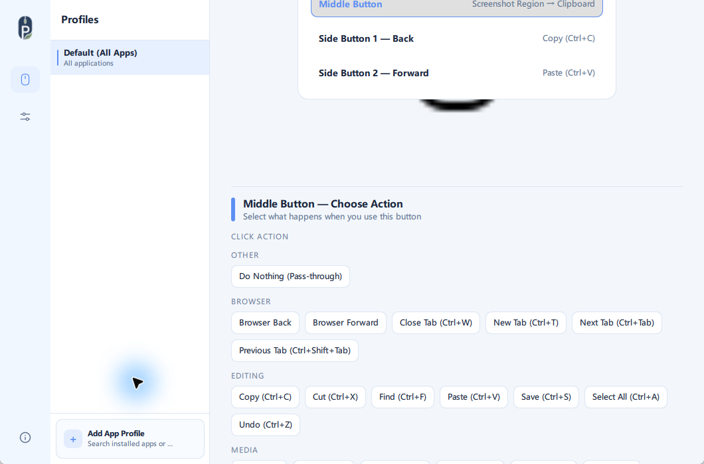
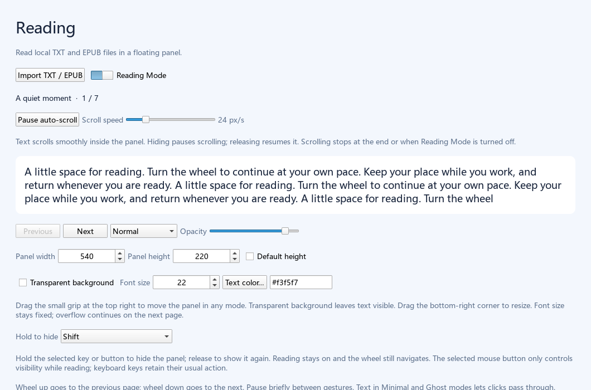
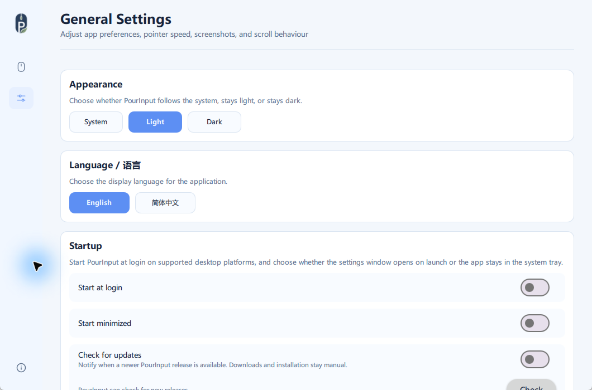
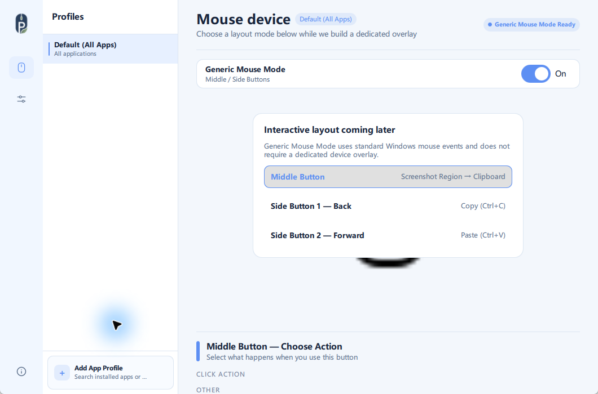

<p align="center">
  
</p>

# PourInput

**One Button. Two Actions.**

**English** | [简体中文](README_CN.md)

PourInput is a local mouse-button customization app for Windows and macOS. It gives one mouse button separate Click and Long Press actions, helping you perform more work with fewer buttons.

<p>
  <a href="https://github.com/pour-soi/PourInput/releases/download/v1.4.2/PourInput-v1.4.2-Windows.zip">
    
  </a>
  <a href="https://github.com/pour-soi/PourInput/releases/tag/v1.3.4-macos.1">
    
  </a>
  <a href="https://github.com/pour-soi/PourInput/releases/tag/v1.4.2">
    
  </a>
</p>

[](https://github.com/pour-soi/PourInput/actions/workflows/ci.yml)
[](https://github.com/pour-soi/PourInput/releases)
[](LICENSE)

<p align="center">
  
</p>

| ⚡ Multi-Action | 🖱 Generic Mouse Mode | 📸 Screenshot Actions |
|----------------|-----------------------|-----------------------|
| Independent Click and Long Press actions | Works with standard Windows middle and side buttons | Capture the full screen or a selected region |

## Reading Mode · Windows v1.4.2

**Continuous auto-reading:** smoothly scroll text inside the panel with adjustable speed and start/pause controls. Hold-to-hide pauses movement; releasing resumes it. Stops at the end or when Reading Mode is disabled. Restarts paused at the saved position.

While Reading Mode is enabled, the configured mouse hide button only hides/restores the panel; its original action returns when Reading Mode is disabled. Saved mappings are preserved.

Read local TXT and EPUB files in a quiet desktop overlay and turn pages with your mouse wheel. Documents stay on your computer, independently of mouse profiles.

- **Fixed type, continuous pages**: fill the available space without changing font size; overflow continues on the next page and your place is saved.
- **Move and resize directly**: drag the book-and-sprout grip to move, or the subtle bottom-right corner to resize. Customize background transparency, text color, and font size.
- **Normal / Minimal / Ghost**: an always-on-top panel that does not take focus; Minimal and Ghost text areas allow clicks through.
- **Hold to hide**: release to restore immediately. Reading still owns the wheel while hidden and keeps your place.
- **Works alongside mouse controls**: use Generic Mouse Mode on or off while retaining non-overlapping MX Master enhancements. Turning Reading Mode off restores ordinary scrolling.




Screenshots render this version's actual QML interface with sample text. Open the book icon in the left rail, import a TXT / EPUB, and enable Reading Mode.

## What is PourInput?

PourInput is a local mouse-button customization tool for Windows and macOS. It maps supported buttons to built-in actions, keeps settings on your computer, and can switch mappings automatically through application-specific profiles.

Its Multi-Action model gives a button two useful roles: one action for a Click and another for a Long Press. Generic Mouse Mode extends that workflow to standard Windows middle and side-button events.

## Why PourInput?

- **Get more from each button** with separate Click and Long Press actions.
- **Keep configuration local** without depending on proprietary device software.
- **Adapt to each application** with automatically selected profiles.
- **Use a focused desktop app** designed around clear, practical mouse workflows.

## Key Features

- **Multi-Action Click / Long Press** — run one action for a click and another after holding the same supported button.
- **Generic Mouse Mode** — map standard Windows Middle Button, Side Button 1, and Side Button 2 events.
- **Application Profiles** — switch button mappings automatically for different applications.
- **Built-in Screenshot Actions** — capture the full screen or a selected region to the clipboard or a file.
- **Multi-language UI** — switch the visible interface between English and Simplified Chinese without changing saved mappings.
- **Packaged Desktop Builds** — use the portable Windows release or a separate Apple Silicon / Intel macOS build without installing Python.

## How It Works

1. **Choose a mouse button.**
2. **Assign a Click Action.**
3. **Assign a Long Press Action.**
4. **Use the button naturally.**

A press shorter than 300 ms runs the Click Action. A press held for at least 300 ms runs the Long Press Action when released. If no Long Press Action is configured, the button keeps the same behavior it had before Multi-Action support.

## More Screenshots

| General Settings | Generic Mouse Mode |
|---|---|
|  |  |

## Download & Installation

### Windows (stable)

Download the official Windows package:

[**PourInput-v1.4.2-Windows.zip**](https://github.com/pour-soi/PourInput/releases/download/v1.4.2/PourInput-v1.4.2-Windows.zip) · [Release Notes](https://github.com/pour-soi/PourInput/releases/tag/v1.4.2)

1. Download the ZIP archive.
2. Extract it to a normal folder.
3. Run `PourInput/PourInput.exe`.
4. Quit any other PourInput build before launching this one.

The package includes its required runtime files and creates its configuration automatically on first launch.

<details>
<summary>Official release files</summary>

- `PourInput-v1.4.2-Windows.zip`
- `PourInput-v1.4.2-Windows.zip.sha256`
- `pourinput-v1.4.2-update.json`

</details>

### macOS

Choose the build for your Mac:

- [**Apple Silicon (M1 or newer)**](https://github.com/pour-soi/PourInput/releases/download/v1.3.4-macos.1/PourInput-1.3.4-macOS-arm64.zip)
- [**Intel Mac**](https://github.com/pour-soi/PourInput/releases/download/v1.3.4-macos.1/PourInput-1.3.4-macOS-x86_64.zip)
- [Release Notes](https://github.com/pour-soi/PourInput/releases/tag/v1.3.4-macos.1)

1. Download the correct ZIP archive and extract it.
2. Move `PourInput.app` to Applications if desired.
3. On first launch, right-click `PourInput.app` and choose **Open**.
4. When prompted, allow PourInput in **System Settings → Privacy & Security → Accessibility**.

This macOS release is unsigned and unnotarized, so macOS may display a security warning. It has been manually tested on an Intel MacBook Air with an MX Master 3; the Apple Silicon package has passed automated build validation but has not yet been tested on physical Apple Silicon hardware. Generic Mouse Mode remains Windows-only.

<details>
<summary>macOS release files</summary>

- `PourInput-1.3.4-macOS-arm64.zip`
- `PourInput-1.3.4-macOS-arm64.zip.sha256`
- `PourInput-1.3.4-macOS-x86_64.zip`
- `PourInput-1.3.4-macOS-x86_64.zip.sha256`

</details>

Linux remains validation-only.

## Compatibility

### Generic Mouse Mode

Generic Mouse Mode is Windows-only, disabled by default, and enabled manually in Settings. It listens for standard Windows mouse events and does not require Logitech HID++ or a connected supported Logitech device.

| Button | Supported slots |
|--------|-----------------|
| Middle Button | Click Action, Long Press Action |
| Side Button 1 | Click Action, Long Press Action |
| Side Button 2 | Click Action, Long Press Action |

When Generic Mouse Mode is enabled alongside a supported Logitech mouse, existing Logitech-specific controls remain available and PourInput avoids duplicate middle-button or side-button entries. Turning the mode off restores native behavior for those standard events.

Generic Mouse Mode cannot currently distinguish multiple standard mice by physical source. It does not support left- or right-button remapping, scroll up/down remapping, arbitrary extra buttons, or vendor-specific buttons that do not appear as standard Windows mouse events.

### Device Support

PourInput uses capability-based device support. It enables features according to what a device exposes rather than treating support as a simple brand-based yes/no list.

A mouse with standard Windows middle and side buttons can use Generic Mouse Mode. A supported Logitech device may expose additional HID++ features such as Mode Shift, SmartShift, adjustable DPI, battery reporting, gesture controls, and horizontal scroll.

Some Logitech controls must be both reprogrammable and divertable before PourInput can intercept them. If capability information is missing or incomplete, PourInput falls back conservatively to its existing catalog and generic behavior rather than assuming full support.

### Tested Devices

| Device | Status |
|--------|--------|
| ZOWIE mouse with standard Windows middle and side buttons | Manually verified with Generic Mouse Mode on Windows |
| MX Master 3 | Tested for cataloged Multi-Action controls and HID++ capability detection |

### Experimental / Potentially Compatible

These devices are not claimed as officially supported unless they have been tested with PourInput. They may work when they expose matching standard Windows events or HID++ capabilities.

| Device | Notes |
|--------|-------|
| Standard Windows mice with middle and side buttons | Potentially compatible with Generic Mouse Mode for middle-button and side-button Click and Long Press actions |
| MX Master 3S | Expected to share many MX Master capabilities; needs user/device testing |
| M720 Triathlon | Potentially compatible where required HID++ controls are exposed |
| MX Anywhere series | Potentially compatible where required HID++ controls are exposed |
| MX Master 4 / 2S / original MX Master | Potentially compatible where required HID++ controls are exposed |
| Other Logitech HID++ devices | Potentially compatible when they expose matching reprogrammable, divertable controls |

Multi-Action is available for Generic Mouse Mode middle/side buttons and supported Logitech controls where those controls are exposed. Device-specific capabilities vary by device and firmware.

If your mouse is detected but a button is missing, open a device support request and include the device info JSON from the Mouse page.

## Limitations

- Generic Mouse Mode currently supports only Middle Button, Side Button 1, and Side Button 2.
- Generic Mouse Mode does not identify separate standard mice per physical device yet.
- Some Logitech features depend on device firmware and exposed HID++ capabilities.
- Double Click is planned but not implemented yet.
- Long Press timeout is fixed at 300 ms and is not configurable in the UI yet.
- Macro support and sequential actions are not implemented yet.

## Troubleshooting

- If PourInput does not start, make sure the archive was extracted before running `PourInput.exe`.
- If a standard mouse button is missing, confirm that Generic Mouse Mode is enabled in Settings.
- If native middle-click or browser Back / Forward does not return, turn Generic Mouse Mode off and restart PourInput.
- If a Logitech button is missing, the device may not expose the required HID++ capability. Open a device support request with the device info JSON from the Mouse page.
- If the application language does not match your choice, open Settings, select the language again, and restart PourInput.

## Roadmap

- **Cross-device workflows** — explore smoother workflows across connected computers and devices. Enhanced Easy-Switch may be one possible implementation direction for supported hardware.
- **Action Layers** — let the same physical buttons perform different actions in different layers.
- **Advanced Multi-Action** — expand beyond the current Click and Long Press model into richer button interactions and action workflows.
- **Broader device compatibility** — extend capability-based support as more devices can be tested and documented.

These are development directions, not guaranteed release commitments or fixed deadlines.

## Development

[](requirements.txt)

Start with the [architecture overview](docs/ARCHITECTURE.md), [development guide](DEVELOPMENT.md), and [Pour product-family design system](docs/POUR_DESIGN_SYSTEM.md).

```powershell
python -m venv .venv
.\.venv\Scripts\python.exe -m pip install -r requirements.txt
.\.venv\Scripts\python.exe main_qml.py
.\.venv\Scripts\python.exe -m unittest discover -s tests
```

See [DEVELOPMENT.md](DEVELOPMENT.md) for platform setup, packaging, architecture, and verification details.

## Contributing

Contributions are welcome, especially focused bug fixes, tests, documentation improvements, and device support data. Keep behavior changes small and tested, update documentation for user-visible changes, and include device info JSON when changing device support.

See [CONTRIBUTING.md](CONTRIBUTING.md), [CONTRIBUTING_DEVICES.md](CONTRIBUTING_DEVICES.md), and [DEVELOPMENT.md](DEVELOPMENT.md) before opening a pull request.

## Acknowledgements

Historical acknowledgement: early PourInput development incorporated work from the [Mouser](https://github.com/TomBadash/Mouser) project. PourInput is now independently designed, maintained, configured, and released; Mouser is not required to run it.

Maintainer: `pour-soi`

## License

PourInput is licensed under the MIT License. Copyright and attribution notices are preserved in [LICENSE](LICENSE).
