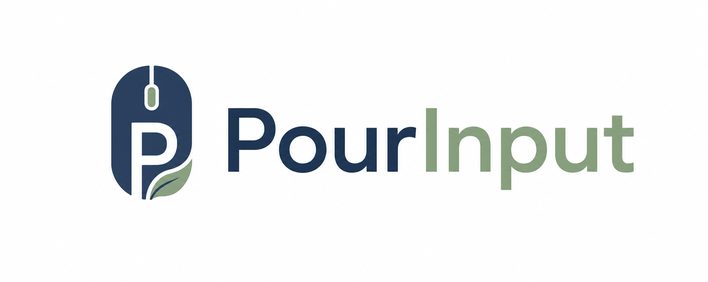
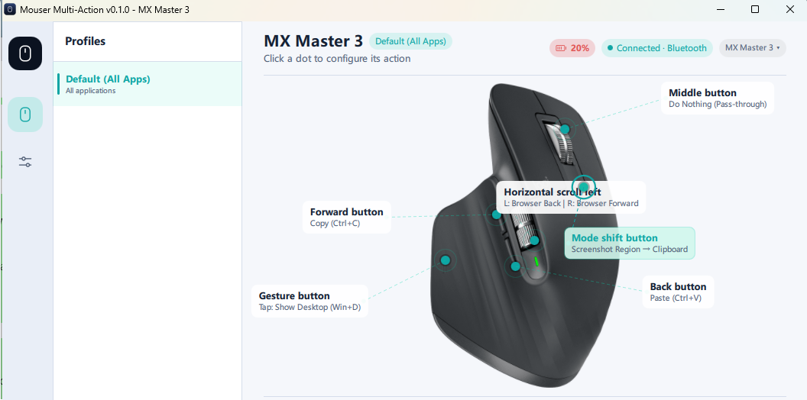
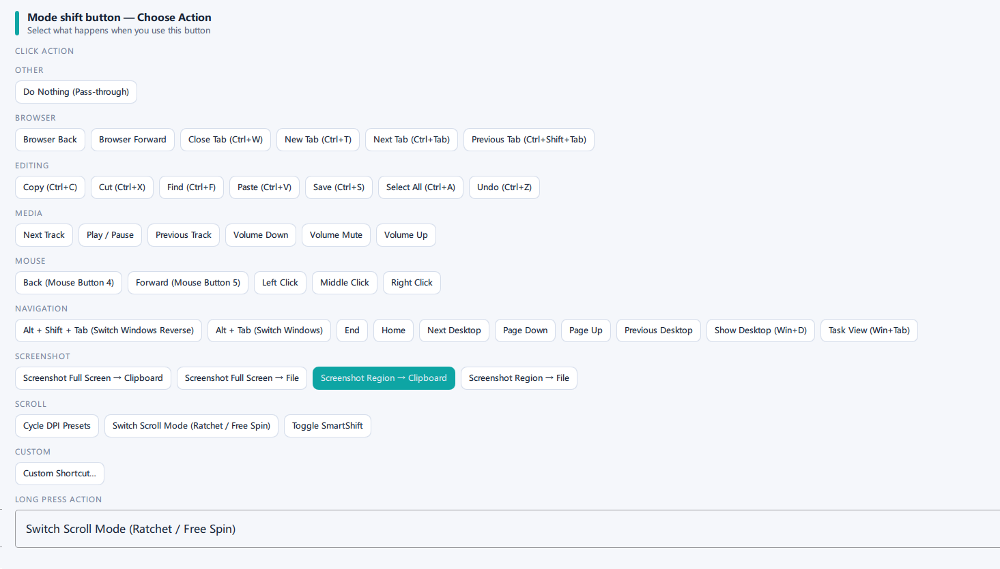
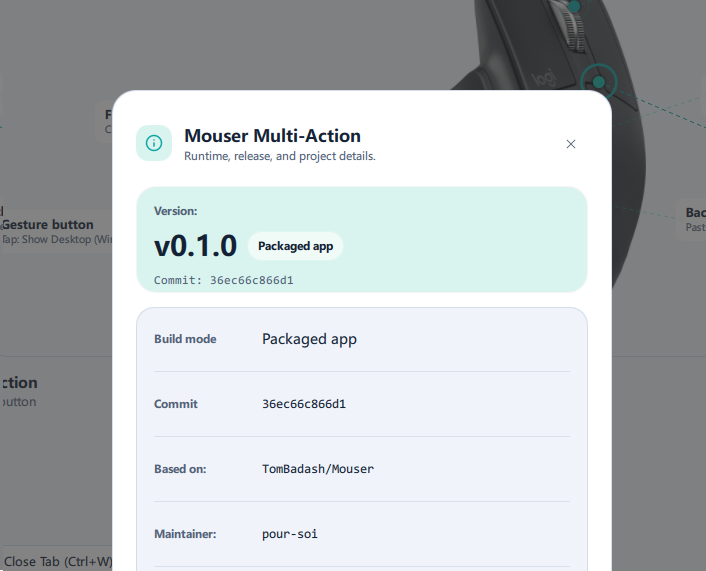

<p align="center">
  
</p>

# PourInput

**一个按键，两种操作。**

🌐 [English](README.md) | **简体中文**

[](https://github.com/pour-soi/PourInput/actions/workflows/ci.yml)
[](https://github.com/pour-soi/PourInput/releases)
[](LICENSE)
[](requirements.txt)

PourInput 是一款开源鼠标自定义工具，面向高级按键操作和多操作（Multi-Action）输入。

PourInput 最初基于 [Mouser](https://github.com/TomBadash/Mouser) 开发，现在已经形成自己的多操作系统、基于设备能力的支持架构、通用鼠标模式（Generic Mouse Mode）、中英文界面切换和独立开发路线。

仓库：`pour-soi/PourInput`

## 当前版本

当前版本：`v1.2.0`

发布日期：`2026-07-09`

发布标题：`v1.2.0 — Generic Mouse Mode & Chinese UI`

v1.2.0 的官方发布平台仅限 Windows。公开的 GitHub Release 资产只包括 Windows 发布包和更新清单。

## 项目介绍

很多鼠标都有额外按键，但一个按键只能绑定一个动作并不总是够用。PourInput 的目标是让受支持的鼠标按键更灵活，同时保持输入路径清晰、可检查、可调试。

多操作让一个物理鼠标按键可以根据使用方式执行不同动作。PourInput 目前支持分别设置单击操作（Click Action）和长按操作（Long Press Action）。例如，同一个侧键可以在单击时复制文本，在长按时执行浏览器前进。

通用鼠标模式可以让使用 Windows 标准中键和侧键事件的普通鼠标使用 PourInput 动作，不需要 Logitech HID++，也不需要连接受支持的 Logitech 鼠标。受支持按键可以分别设置单击和长按；关闭该模式后，中键点击和浏览器返回 / 前进会恢复原生行为。

与 Logitech Options+ 相比，PourInput 是开源项目，更容易审查、脚本化和排查输入行为。它不打算替代 Options+ 的所有功能，而是专注于可配置的按键重映射和高级按键操作。

## 功能

- **多操作单击 / 长按支持**：受支持按键可以在单击时执行一个动作，在长按时执行另一个动作。
- **通用鼠标模式支持 Windows 标准按键**：中键、侧键 1 和侧键 2 可以在不依赖 Logitech HID++ 的情况下映射到 PourInput 动作。
- **无需受支持的 Logitech 鼠标**：即使没有连接受支持的 Logitech 设备，该模式也可以显示受支持的标准鼠标按键。
- **运行时开关**：该模式默认关闭，需要在设置中手动启用；关闭后，受支持按键会恢复原生行为。
- **Logitech 控件保持可用**：现有 Logitech 专用控件仍然可用；连接受支持的 Logitech 鼠标并启用通用鼠标模式时，不会产生重复的中键或侧键条目。
- **应用界面语言切换**：用户可以在设置中切换 English / 简体中文。
- **语言偏好保存**：没有保存偏好时默认使用 English；选择的语言会保存，并在下次启动时恢复。
- **映射和配置兼容**：语言切换只改变可见文本，不会改变内部动作 ID、按键键名、映射或配置文件数据。
- **基于设备能力的支持架构**：PourInput 会根据设备实际具备的能力开放相应功能，而不是简单地按品牌判断是否支持。
- **Logitech HID++ 高级功能**：受支持的 Logitech 设备可能提供 Mode Shift、SmartShift、可调 DPI、电量读取、手势控制和水平滚动等能力。
- **按应用切换配置文件**：可以为不同应用自动切换鼠标按键映射。
- **内置截图动作**：可以将全屏或选区截图保存到剪贴板或文件。
- **Windows 便携发布包**：正式发布包不需要用户安装 Python。

## 截图说明

### 主窗口

在鼠标页面配置当前设备、配置文件和受支持的按键映射。



### 多操作配置

为受支持的单击或长按槽位选择动作。



### 关于

查看 PourInput 版本、维护者、上游致谢、构建模式、提交信息和启动路径。



## 下载

请从 [最新发布页面](https://github.com/pour-soi/PourInput/releases/latest) 下载当前 Windows 版本。

Windows 用户应下载：

```text
PourInput-v1.2.0-Windows.zip
```

请先解压下载的压缩包，再运行 PourInput。

## 安装

1. 从 [最新发布页面](https://github.com/pour-soi/PourInput/releases/latest) 下载 `PourInput-v1.2.0-Windows.zip`。
2. 解压 zip 文件。
3. 运行 `PourInput-v1.2.0/PourInput.exe`。
4. 如果已经运行了其他 PourInput 或 PourInput 构建，请先退出后再启动。

Windows 发布包已经包含所需运行文件。使用正式发布包时，不需要另外安装 Python。

## 首次运行

首次启动时，PourInput 会自动创建配置文件。没有保存语言偏好时，默认使用 English。

打开设置可以启用通用鼠标模式，也可以切换应用界面语言。

## 使用方法

打开鼠标页面，然后选择一个受支持的按键。

每个受支持的多操作按键可以显示：

- **单击操作**
- **长按操作**

示例：

- 中键：单击 -> 复制，长按 -> 粘贴
- 侧键 1：单击 -> 复制，长按 -> 浏览器前进
- 侧键 2：单击 -> 粘贴，长按 -> 浏览器后退
- 受支持 Logitech 设备上的 Mode Shift：单击 -> 截图选区到剪贴板，长按 -> 切换滚轮模式

按下时间短于 300 ms 时执行单击操作。按住至少 300 ms 后松开时执行长按操作。

如果没有设置长按操作，该按键会保持加入多操作框架之前的行为。

## 按键与操作说明

通用鼠标模式支持以下 Windows 标准鼠标按键：

| 按键 | 支持的操作槽位 |
|------|----------------|
| 中键 | 单击操作、长按操作 |
| 侧键 1 | 单击操作、长按操作 |
| 侧键 2 | 单击操作、长按操作 |

通用鼠标模式不支持左键重映射、右键重映射、向上 / 向下滚动重映射，也不支持任意额外鼠标按键。

## 通用鼠标模式

通用鼠标模式仅支持 Windows。它默认关闭，需要在设置中手动启用。

该模式不需要连接受支持的 Logitech 鼠标。它会监听 Windows 标准中键和侧键事件，然后为中键、侧键 1 和侧键 2 执行已配置的 PourInput 单击操作或长按操作。

现有 Logitech 专用控件仍然可用。当连接受支持的 Logitech 鼠标并启用通用鼠标模式时，PourInput 会避免显示重复的中键或侧键条目。

多只标准鼠标目前还不能分别设置不同的通用映射，因为标准 Windows 鼠标事件不会区分事件来自哪一只物理鼠标。

该模式并不代表 PourInput 已经支持所有鼠标、所有鼠标按键、所有操作系统，或不会显示为 Windows 标准鼠标事件的厂商专有按键。

## 软件语言切换

PourInput 支持：

- English
- 简体中文

没有保存语言偏好时，默认使用 English。用户可以在设置中切换语言，选择结果会保存，并在下次启动时恢复。

可见应用界面会切换语言，但内部动作 ID、按键键名、映射和配置文件数据不会改变。现有用户映射保持兼容。

## 支持设备

PourInput 采用基于设备能力的支持架构。也就是说，PourInput 会根据设备实际具备的能力开放相应功能，而不是简单地按照品牌判断“支持”或“不支持”。带有 Windows 标准中键和侧键的鼠标可以使用通用鼠标模式，受支持的 Logitech 设备还可以使用额外的 HID++ 功能。

某些 Logitech 控件必须同时支持重新编程和转发拦截，PourInput 才能接管并重映射。如果能力信息缺失或不完整，PourInput 会保守地回退到现有设备目录和通用按键行为，而不会假定设备完整支持所有功能。

### 已测试设备

| 设备 | 状态 |
|------|------|
| 带 Windows 标准中键和侧键的 ZOWIE 鼠标 | 已在 Windows 上通过通用鼠标模式手动验证 |
| MX Master 3 | 已测试已编目的多操作控件和 HID++ 能力检测 |

### 实验性 / 可能兼容设备

以下设备不视为官方已支持，除非已经在 PourInput 中完成实际测试。它们在暴露匹配的 Windows 标准中键 / 侧键事件或 HID++ 能力时可能可用。

| 设备 | 说明 |
|------|------|
| 带中键和侧键的 Windows 标准鼠标 | 可能可通过通用鼠标模式使用中键和侧键的单击 / 长按动作 |
| MX Master 3S | 预计与 MX Master 系列共享多项能力；仍需要用户和设备测试 |
| M720 Triathlon | 暴露所需 HID++ 控件时可能兼容 |
| MX Anywhere 系列 | 暴露所需 HID++ 控件时可能兼容 |
| MX Master 4 / 2S / 初代 MX Master | 暴露所需 HID++ 控件时可能兼容 |
| 其他 Logitech HID++ 设备 | 暴露匹配的可重新编程、可转发拦截控件时可能兼容 |

多操作支持适用于通用鼠标模式中的中键 / 侧键，也适用于已暴露对应控件的受支持 Logitech 设备。DPI、SmartShift、电量、手势控制和水平滚动等设备能力会因设备和固件而异。

如果鼠标已被检测到但缺少某个按键，请在设备支持请求中附上鼠标页面导出的 device info JSON。

## 兼容性

现有用户映射与 v1.2.0 保持兼容。语言切换只改变可见文本，不会重写动作 ID、按键键名、映射或配置文件。

通用鼠标模式内部使用独立的通用侧键映射键，因此可以与受支持的 Logitech 布局共存，而不会出现重复的可见侧键条目。

## 使用限制

- v1.2.0 的官方发布目标仅限 Windows。
- 通用鼠标模式仅支持 Windows。
- 通用鼠标模式目前只支持中键、侧键 1 和侧键 2。
- 通用鼠标模式不支持左键重映射、右键重映射、向上 / 向下滚动重映射，也不支持任意额外鼠标按键。
- 通用鼠标模式目前还不能按物理设备区分多只标准鼠标。
- 不会显示为 Windows 标准鼠标事件的厂商专有按键不属于通用鼠标模式的支持范围。
- 部分 Logitech 功能取决于设备固件和暴露出的 HID++ 能力。
- macOS 支持已规划，但尚未正式提供。
- Linux 构建仍属于验证用途，不是官方公开发布目标。
- 双击操作已规划，但尚未实现。
- 长按判定时间（Long Press Threshold）固定为 300 ms，暂时不能在界面中配置。
- 宏和连续动作尚未实现。

## 问题排查

- 如果 PourInput 无法启动，请确认已经先解压压缩包，再运行 `PourInput.exe`。
- 如果标准鼠标按键没有显示，请确认已经在设置中启用通用鼠标模式。
- 如果原生中键点击或浏览器返回 / 前进没有恢复，请关闭通用鼠标模式并重新启动 PourInput。
- 如果 Logitech 按键没有显示，设备可能没有暴露所需 HID++ 能力。请在设备支持请求中附上鼠标页面导出的 device info JSON。
- 如果应用语言没有按选择显示，请打开设置重新选择语言，然后重启 PourInput。

## 从源代码运行

要求：

- Python 3.12
- `requirements.txt` 中的依赖
- 用于打包构建的 PyInstaller

创建环境并安装依赖：

```powershell
python -m venv .venv
.\.venv\Scripts\python.exe -m pip install -r requirements.txt
```

从源代码运行应用：

```powershell
.\.venv\Scripts\python.exe main_qml.py
```

运行测试：

```powershell
.\.venv\Scripts\python.exe -m unittest discover -s tests
```

构建 Windows 应用：

```powershell
.\.venv\Scripts\python.exe -m PyInstaller PourInput.spec --noconfirm
```

原始构建输出会写入 `dist/PourInput/`。

## 打包发布

创建带版本号的 Windows 发布包：

```powershell
.\scripts\create_release.ps1 -Version v1.2.0
```

如果没有指定版本，打包脚本会读取 `release/` 中最新的 Windows zip 包，并递增补丁版本号。

发布输出：

```text
release/
    PourInput-v1.2.0-Windows.zip
    RELEASE_NOTES-v1.2.0.md
    CHANGELOG.md
```

压缩包结构：

```text
PourInput-v1.2.0/
    PourInput.exe
    LICENSE
    README.md
    CHANGELOG.md
    RELEASE_NOTES.md
    所有必需运行文件
```

发布脚本只会删除临时构建输出。它会保留 `.git`、源代码、发布历史、设置、日志和已有版本发布包。

## 发布平台说明

v1.2.0 仍然只把 Windows 作为官方发布平台。

公开的 GitHub Release 应只包含：

- `PourInput-v1.2.0-Windows.zip`
- `pourinput-v1.2.0-update.json`

macOS 和 Linux 的 CI / 构建验证可以继续保留，但公开发布资产中不应加入 macOS 或 Linux 包。

## 后续计划

### 已完成

- **多操作单击 / 长按支持**：一个受支持的物理按键可以为单击和长按执行不同动作。
- **通用鼠标模式**：Windows 标准中键、侧键 1 和侧键 2 可以在不依赖 Logitech HID++ 的情况下使用 PourInput 动作；关闭后恢复原生中键点击和浏览器返回 / 前进行为。
- **应用语言切换**：可见界面可以在 English 和简体中文之间切换，并且不会改变已有映射。
- **基于设备能力的支持架构**：PourInput 可以根据检测到的设备能力开放或限制功能，而不是只依赖静态设备列表。

### 计划 / 未来方向

未来开发重点是增强型 Easy-Switch、操作层（Action Layers）和更高级的多操作工作流。

- **增强型 Easy-Switch**：Easy-Switch 是 Logitech 的设备切换功能，可以让受支持鼠标在已配对的电脑或设备之间切换。增强型 Easy-Switch 是 PourInput 计划探索的方向，目标是让用户更方便地在已连接电脑之间切换，而不必只依赖鼠标原本的切换方式。它也可能成为未来跨设备工作流的基础。
- **操作层**：操作层计划让同一个物理鼠标按键在不同层中执行不同功能。这样即使鼠标按键数量有限，也可以通过切换层获得更多可用操作。
- **高级多操作**：这是现有单击与长按系统的未来扩展方向，目标是探索更丰富的按键交互和操作工作流。

这些内容是开发方向，不是已经承诺的功能、固定发布时间或保证交付范围。

## 参与贡献

欢迎贡献文档改进、测试、设备支持数据和聚焦的错误修复。

提交拉取请求前：

1. 保持行为变更小而清晰，并添加相应测试。
2. 运行 `python -m unittest discover -s tests`。
3. 修改鼠标支持时，请包含设备信息 JSON。
4. 修改用户可见行为时，请同步更新文档。

未来如果要添加新的多操作按键：

1. 将按键键名加入多操作按键配置。
2. 确认该按键同时具有按下和松开事件。
3. 添加默认长按映射。
4. 通过后端设备能力数据暴露该按键。
5. 添加聚焦的引擎、配置、后端和界面测试。

更多信息见 [CONTRIBUTING.md](CONTRIBUTING.md)、[CONTRIBUTING_DEVICES.md](CONTRIBUTING_DEVICES.md) 和 [DEVELOPMENT.md](DEVELOPMENT.md)。

## 致谢

PourInput 基于原始 [Mouser](https://github.com/TomBadash/Mouser) 项目。感谢 Mouser 贡献者创建了让本项目成为可能的基础。

PourInput 将继续独立开发，同时尊重并致谢原始项目。

维护者：`pour-soi`

## 许可证

本项目保留原始 Mouser 许可证。详见 [LICENSE](LICENSE)。
