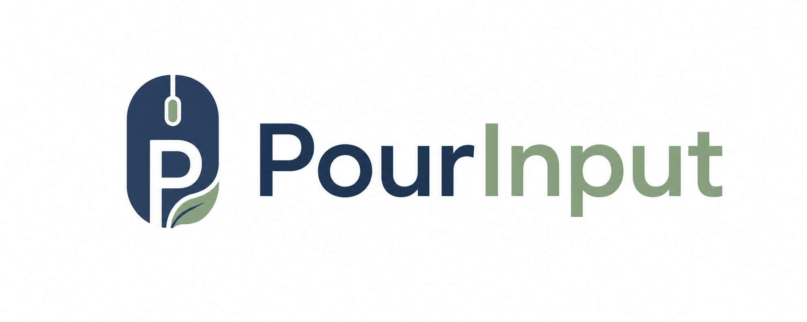

<p align="center">
  
</p>

# PourInput

**一个按键，两种操作。**

[English](README.md) | **简体中文**

PourInput 是一款面向 Windows 和 macOS 的本地鼠标按键自定义应用。它让同一个鼠标按键分别执行单击与长按操作，以更少的按键完成更多工作。

<p>
  <a href="https://github.com/pour-soi/PourInput/releases/download/v1.4.2/PourInput-v1.4.2-Windows.zip">
    
  </a>
  <a href="https://github.com/pour-soi/PourInput/releases/tag/v1.3.4-macos.1">
    
  </a>
  <a href="https://github.com/pour-soi/PourInput/releases/tag/v1.4.2">
    
  </a>
</p>

[](https://github.com/pour-soi/PourInput/actions/workflows/ci.yml)
[](https://github.com/pour-soi/PourInput/releases)
[](LICENSE)

<p align="center">
  
</p>

| ⚡ 多动作 | 🖱 通用鼠标模式 | 📸 截图功能 |
|-----------|----------------|-------------|
| 单击与长按可分别执行不同操作 | 支持标准 Windows 中键与侧键 | 支持全屏或区域截图 |

## 阅读模式 · Windows v1.4.2

**自动连续阅读**：文字在浮窗内平滑滚动，可调节速度、暂停和继续。按住隐藏键时暂停，松开后继续；读到末尾或关闭阅读模式时停止。重开软件后恢复阅读位置，等待你手动开始。

阅读模式开启时，设为隐藏键的鼠标按键只负责隐藏和恢复浮窗；关闭阅读模式后自动恢复原来的按键功能，已保存的映射不会改变。

把本地 TXT 或 EPUB 放进一个安静的桌面阅读浮窗，用鼠标滚轮翻页。无需上传文件，也不依赖当前鼠标配置文件。

- **固定字号，连续分页**：按浮窗容量填满每页，多出的文字接到下一页，阅读位置自动保存。
- **随手移动和缩放**：拖动书页嫩芽图标移动，拖动右下角淡角标调整大小；支持透明背景、自定义文字颜色和字号。
- **标准 / 简洁 / 隐约**：浮窗置顶、不抢焦点，简洁和隐约模式的正文可鼠标穿透。
- **按住暂时隐藏**：松开立即恢复，隐藏期间仍由阅读模式接管滚轮，不改变阅读位置。
- **与鼠标功能共存**：支持通用鼠标模式开或关；不冲突的 MX Master 高级功能仍可使用。关闭阅读模式即恢复普通滚动。


截图由本版实际 QML 界面渲染，使用示例文字。打开左侧书本图标，导入 TXT / EPUB 后启用阅读模式。

## PourInput 是什么？

PourInput 是一款在 Windows 和 macOS 上运行的本地鼠标按键自定义工具。它可以将受支持的按键映射到内置操作，将设置保存在本机，并通过按应用切换的配置文件自动选择不同映射。

多操作模式让一个按键承担两种实用功能：单击时执行一个操作，长按时执行另一个操作。通用鼠标模式还可以把这套工作方式扩展到 Windows 标准中键和侧键事件。

## 为什么选择 PourInput？

- **充分利用每个按键**：分别设置单击与长按操作。
- **配置保存在本地**：无需依赖专有设备软件。
- **适应不同应用**：通过自动选择的配置文件切换映射。
- **专注实用工作流**：使用清晰、独立的桌面应用管理鼠标操作。

## 主要功能

- **多操作单击 / 长按**：同一个受支持按键可在单击和长按时分别执行不同操作。
- **通用鼠标模式**：映射 Windows 标准中键、侧键 1 和侧键 2 事件。
- **按应用切换配置文件**：针对不同应用自动切换鼠标按键映射。
- **内置截图操作**：将全屏或选区截图保存到剪贴板或文件。
- **多语言界面**：在 English 与简体中文之间切换界面，不改变已有映射。
- **桌面发布包**：无需单独安装 Python，即可使用 Windows 便携版或单独提供的 Apple Silicon / Intel macOS 版本。

## 工作方式

1. **选择一个鼠标按键。**
2. **设置单击操作。**
3. **设置长按操作。**
4. **像平常一样使用这个按键。**

按下时间短于 300 ms 时执行单击操作。按住至少 300 ms 后松开时执行长按操作。如果没有设置长按操作，该按键会保持加入多操作支持之前的行为。

## 更多截图

| 通用设置 | 通用鼠标模式 |
|---|---|
|  |  |

## 下载与安装

### Windows（稳定版）

下载官方 Windows 发布包：

[**PourInput-v1.4.2-Windows.zip**](https://github.com/pour-soi/PourInput/releases/download/v1.4.2/PourInput-v1.4.2-Windows.zip) · [版本说明](https://github.com/pour-soi/PourInput/releases/tag/v1.4.2)

1. 下载 ZIP 压缩包。
2. 将压缩包解压到普通文件夹。
3. 运行 `PourInput/PourInput.exe`。
4. 启动前先退出正在运行的其他 PourInput 构建。

发布包已经包含所需运行文件，并会在首次启动时自动创建配置。

<details>
<summary>官方发布文件</summary>

- `PourInput-v1.4.2-Windows.zip`
- `PourInput-v1.4.2-Windows.zip.sha256`
- `pourinput-v1.4.2-update.json`

</details>

### macOS

根据 Mac 机型选择下载：

- [**Apple Silicon（M1 或更新机型）**](https://github.com/pour-soi/PourInput/releases/download/v1.3.4-macos.1/PourInput-1.3.4-macOS-arm64.zip)
- [**Intel Mac**](https://github.com/pour-soi/PourInput/releases/download/v1.3.4-macos.1/PourInput-1.3.4-macOS-x86_64.zip)
- [版本说明](https://github.com/pour-soi/PourInput/releases/tag/v1.3.4-macos.1)

1. 下载适合机型的 ZIP 压缩包并解压。
2. 如有需要，将 `PourInput.app` 移到“应用程序”文件夹。
3. 首次启动时，右键点击 `PourInput.app`，然后选择“打开”。
4. 按提示前往“系统设置 → 隐私与安全性 → 辅助功能”，允许 PourInput。

此 macOS 正式版尚未签名和公证，因此 macOS 可能显示安全警告。Intel 版已在配合 MX Master 3 的 MacBook Air 上完成手动测试；Apple Silicon 发布包已通过自动构建验证，但尚未在 Apple Silicon 实机上测试。通用鼠标模式仍仅支持 Windows。

<details>
<summary>macOS 正式版文件</summary>

- `PourInput-1.3.4-macOS-arm64.zip`
- `PourInput-1.3.4-macOS-arm64.zip.sha256`
- `PourInput-1.3.4-macOS-x86_64.zip`
- `PourInput-1.3.4-macOS-x86_64.zip.sha256`

</details>

Linux 仍仅用于构建验证。

## 兼容性

### 通用鼠标模式

通用鼠标模式仅支持 Windows，默认关闭，需要在设置中手动启用。它监听 Windows 标准鼠标事件，不需要 Logitech HID++，也不需要连接受支持的 Logitech 设备。

| 按键 | 支持的操作槽位 |
|------|----------------|
| 中键 | 单击操作、长按操作 |
| 侧键 1 | 单击操作、长按操作 |
| 侧键 2 | 单击操作、长按操作 |

连接受支持的 Logitech 鼠标并启用通用鼠标模式时，现有 Logitech 专用控件仍然可用，PourInput 也会避免创建重复的中键或侧键条目。关闭通用鼠标模式后，这些标准事件会恢复原生行为。

通用鼠标模式目前不能按物理来源区分多只标准鼠标。它不支持左键或右键重映射、向上 / 向下滚动重映射、任意额外按键，或不会显示为 Windows 标准鼠标事件的厂商专用按键。

### 设备支持

PourInput 采用基于设备能力的支持架构。它根据设备实际暴露的能力启用功能，而不是简单地按照品牌判断“支持”或“不支持”。

带有 Windows 标准中键和侧键的鼠标可以使用通用鼠标模式。受支持的 Logitech 设备还可能提供 Mode Shift、SmartShift、可调 DPI、电量读取、手势控件和水平滚动等 HID++ 功能。

某些 Logitech 控件必须同时支持重新编程和转发拦截，PourInput 才能接管。如果能力信息缺失或不完整，PourInput 会保守地回退到现有设备目录和通用行为，而不会假定设备完整支持所有功能。

### 已测试设备

| 设备 | 状态 |
|------|------|
| 带 Windows 标准中键和侧键的 ZOWIE 鼠标 | 已在 Windows 上通过通用鼠标模式手动验证 |
| MX Master 3 | 已测试已编目的多操作控件和 HID++ 能力检测 |

### 实验性 / 可能兼容设备

以下设备只有在 PourInput 中完成实际测试后，才会被视为正式支持。当它们暴露匹配的 Windows 标准事件或 HID++ 能力时，可能可以正常使用。

| 设备 | 说明 |
|------|------|
| 带中键和侧键的 Windows 标准鼠标 | 可能通过通用鼠标模式使用中键和侧键的单击 / 长按操作 |
| MX Master 3S | 预计与 MX Master 系列共享多项能力；仍需要用户和设备测试 |
| M720 Triathlon | 暴露所需 HID++ 控件时可能兼容 |
| MX Anywhere 系列 | 暴露所需 HID++ 控件时可能兼容 |
| MX Master 4 / 2S / 初代 MX Master | 暴露所需 HID++ 控件时可能兼容 |
| 其他 Logitech HID++ 设备 | 暴露匹配的可重新编程、可转发拦截控件时可能兼容 |

多操作支持适用于通用鼠标模式中的中键 / 侧键，也适用于已暴露对应控件的受支持 Logitech 设备。设备专用能力会因设备和固件而异。

如果鼠标已被检测到但缺少某个按键，请在设备支持请求中附上鼠标页面导出的 device info JSON。

## 使用限制

- 通用鼠标模式目前只支持中键、侧键 1 和侧键 2。
- 通用鼠标模式目前还不能按物理设备区分多只标准鼠标。
- 部分 Logitech 功能取决于设备固件和暴露出的 HID++ 能力。
- 双击操作已规划，但尚未实现。
- 长按判定时间固定为 300 ms，暂时不能在界面中配置。
- 宏和连续操作尚未实现。

## 问题排查

- 如果 PourInput 无法启动，请确认已经先解压压缩包，再运行 `PourInput.exe`。
- 如果标准鼠标按键没有显示，请确认已经在设置中启用通用鼠标模式。
- 如果原生中键点击或浏览器返回 / 前进没有恢复，请关闭通用鼠标模式并重新启动 PourInput。
- 如果 Logitech 按键没有显示，设备可能没有暴露所需 HID++ 能力。请在设备支持请求中附上鼠标页面导出的 device info JSON。
- 如果应用语言没有按选择显示，请打开设置重新选择语言，然后重启 PourInput。

## 后续计划

- **跨设备工作流**：探索在已连接电脑和设备之间实现更顺畅的工作方式。对于受支持的硬件，增强型 Easy-Switch 可能是其中一种实现方向。
- **操作层**：让相同的物理按键在不同操作层中执行不同功能。
- **高级多操作**：在现有单击与长按模式之外，探索更丰富的按键交互和操作工作流。
- **更广泛的设备兼容性**：随着更多设备得到测试和记录，继续扩展基于设备能力的支持。

这些内容是开发方向，不是已经承诺的功能、固定发布时间或保证交付范围。

## 开发

[](requirements.txt)

请从[架构概览](docs/ARCHITECTURE.md)、[开发指南](DEVELOPMENT.md)和 [Pour 产品家族设计系统](docs/POUR_DESIGN_SYSTEM.md)开始阅读。

```powershell
python -m venv .venv
.\.venv\Scripts\python.exe -m pip install -r requirements.txt
.\.venv\Scripts\python.exe main_qml.py
.\.venv\Scripts\python.exe -m unittest discover -s tests
```

平台设置、打包、架构和验证细节请参阅 [DEVELOPMENT.md](DEVELOPMENT.md)。

## 参与贡献

欢迎提交聚焦的错误修复、测试、文档改进和设备支持数据。请保持行为变更小而清晰并添加测试；修改用户可见行为时同步更新文档；修改设备支持时附上设备信息 JSON。

提交拉取请求前，请阅读 [CONTRIBUTING.md](CONTRIBUTING.md)、[CONTRIBUTING_DEVICES.md](CONTRIBUTING_DEVICES.md) 和 [DEVELOPMENT.md](DEVELOPMENT.md)。

## 致谢

历史致谢：PourInput 的早期开发采用了 [Mouser](https://github.com/TomBadash/Mouser) 项目的部分工作。PourInput 现已独立设计、维护、配置和发布；运行 PourInput 不需要 Mouser。

维护者：`pour-soi`

## 许可证

PourInput 采用 MIT 许可证。版权与署名声明保留在 [LICENSE](LICENSE) 中。
