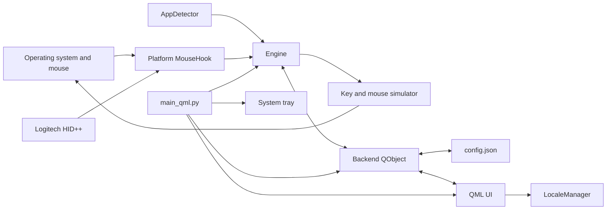
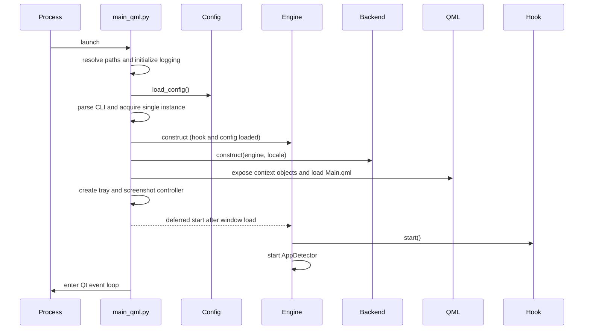
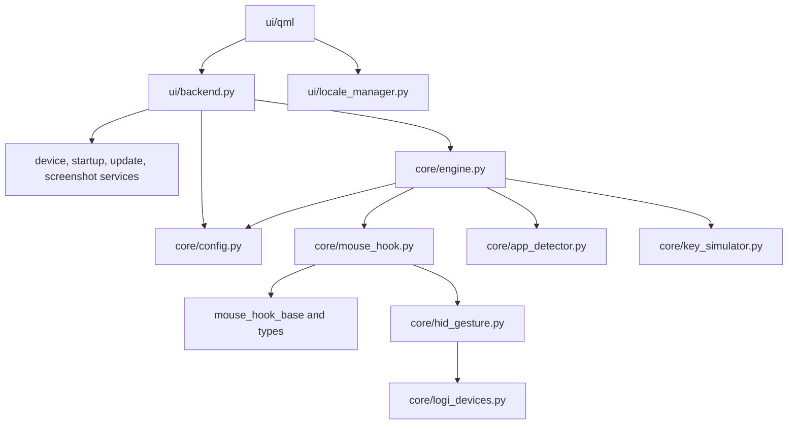

# PourInput Architecture

This document describes the architecture implemented in the current repository. It is an engineering reference, not a roadmap. For detailed flows and ownership boundaries, follow the links in [Related documentation](#related-documentation).

PourInput owns its runtime, configuration, input pipeline, packaging, and update infrastructure. It does not load or require another application's executable, process, service, configuration, or installation.

## Contents

- [System overview](#system-overview)
- [Major modules](#major-modules)
- [Startup and lifecycle](#startup-and-lifecycle)
- [Python and QML interaction](#python-and-qml-interaction)
- [Configuration and persistence](#configuration-and-persistence)
- [Event routing](#event-routing)
- [Platform abstractions](#platform-abstractions)
- [Dependency rules](#dependency-rules)
- [Implementation limitations](#implementation-limitations)
- [Related documentation](#related-documentation)

## System overview

PourInput is a PySide6 desktop application with a QML presentation layer and a Python runtime. `main_qml.py` is the composition root. It creates the core `Engine`, the QML-facing `Backend`, platform screenshot integration, the QML engine, and the system tray.

The runtime is intentionally layered:

1. QML owns presentation and transient interaction state.
2. `ui/backend.py` is the public bridge from QML to Python services and persisted configuration.
3. `core/engine.py` owns live remapping, active runtime profile selection, and device-setting replay.
4. Mouse hooks and action simulation isolate operating-system input APIs.
5. Configuration, device catalogs, app detection, updates, startup integration, and screenshots are supporting services.

## Major modules

| Module | Responsibility | Primary consumers |
|---|---|---|
| `main_qml.py` | Process setup, single-instance behavior, object construction, QML context, tray, lifecycle | Operating system |
| `core/engine.py` | Hook wiring, mapping dispatch, profile auto-switching, HID setting synchronization | `main_qml.py`, `ui/backend.py` |
| `ui/backend.py` | QML properties, slots, signals, persistence orchestration, device/UI projection, update orchestration | QML |
| `core/config.py` | Schema 11 defaults, load, migration, type repair, atomic save, profile helpers | Engine and backend |
| `core/mouse_hook*.py` | Shared hook contract plus Windows, macOS, Linux, and stub implementations | Engine |
| `core/hid_gesture.py` | Logitech HID++ discovery, diverted controls, gestures, DPI, battery, SmartShift | Mouse hooks and engine |
| `core/key_simulator.py` | Platform action catalogs and keyboard/mouse injection | Engine |
| `core/app_detector.py` | Foreground-application polling and normalized runtime identity | Engine |
| `core/app_catalog.py` | Installed/known application discovery and alias resolution | Config and backend |
| `core/logi_devices.py` | Device identity, capabilities, DPI bounds, supported controls | Hook, engine, backend |
| `core/device_layouts.py` | UI layout registry and manual layout choices | Backend |
| `ui/locale_manager.py` | English and Simplified Chinese strings and translated labels | QML, backend, tray |
| `ui/*_screenshot.py` | Platform screenshot controllers | `main_qml.py`, key simulator callback |
| `core/updater.py`, `core/update_installer.py` | Release checks, download verification, staging, Windows installer handoff | Backend |
| `core/startup.py` | Login startup and Linux desktop/icon integration | Backend and entry point |

## Startup and lifecycle

`Engine` is constructed before QML loads but started through `QTimer.singleShot`. On macOS, starting is conditional on Accessibility trust. The application keeps running when its last window closes because the tray is part of the lifecycle. A tray quit explicitly stops the engine; the `finally` block after `app.exec()` calls `engine.stop()` again, and stop operations are designed to be safe when repeated.

The entry point also handles a special Windows update-helper mode before normal UI startup and prevents multiple interactive instances by using a Windows mutex plus a Qt local server.

## Python and QML interaction

The QML engine receives these principal context properties:

- `backend`: a `Backend` QObject containing readable properties and invokable slots.
- `uiState`: system/selected appearance and font information.
- `lm`: the `LocaleManager` QObject.
- application metadata and `launchHidden` values.

QML invokes backend slots for mappings, profiles, settings, device layout overrides, diagnostics, screenshots, and updates. Backend notify signals invalidate QML bindings. Runtime callbacks may originate on hook, HID, detector, or worker threads; the backend converts them to internal Qt signals with queued delivery before changing UI-facing state. SmartShift uses `QMetaObject.invokeMethod` for its Qt-thread handoff.

The QML layer does not import Python modules directly. Image providers registered by `main_qml.py` expose application and native system icons through `image://` URLs.

## Configuration and persistence

`core/config.py` stores a single JSON document at the platform configuration location:

- Windows: `%APPDATA%\PourInput\config.json`
- macOS: `~/Library/Application Support/PourInput/config.json`
- Linux: `$XDG_CONFIG_HOME/PourInput/config.json`, defaulting to `~/.config/PourInput/config.json`

Loading creates the directory, reads JSON when present, migrates older schemas to version 11, merges missing defaults, and repairs type mismatches for default-shaped fields. An unreadable configuration falls back to an in-memory deep copy of defaults. Saving uses a temporary file, flush plus `fsync`, and atomic replacement; non-Windows temporary files receive user-only permissions.

The engine and backend each load their own in-memory configuration dictionary. Backend setters persist changes, then ask the engine to reload mappings or apply a device setting when required. This is coordination by reload and signals, not a shared observable store. See [STATE_MANAGEMENT.md](STATE_MANAGEMENT.md).

## Event routing

Captured input is normalized to `MouseEvent` names. `Engine._setup_hooks()` reads the active profile, decides which events must be blocked, and registers callbacks. Unmapped or unsupported events remain unblocked. A mapped event reaches either:

- a direct keyboard or system action;
- paired mouse-button down/up injection;
- click-versus-long-press selection on release;
- horizontal-scroll accumulation and throttling;
- an engine-owned device action such as DPI cycling or scroll-mode switching; or
- a screenshot controller installed by the entry point.

Foreground-app changes take a separate route: `AppDetector` polls every 300 ms, resolves a profile, and asks the engine to rewire callbacks without restarting the hook or HID connection. Detailed sequences are in [EVENT_FLOW.md](EVENT_FLOW.md).

## Platform abstractions

`core/mouse_hook.py` selects one implementation at import time:

| Platform | Hook implementation | Action implementation |
|---|---|---|
| Windows | `mouse_hook_windows.py` | Win32 input APIs in `key_simulator.py` |
| macOS | `mouse_hook_macos.py` | Quartz/AppKit paths in `key_simulator.py` |
| Linux | `mouse_hook_linux.py` | `evdev`/`uinput` paths in `key_simulator.py` |
| Other | `mouse_hook_stub.py` | inert stubs |

`BaseMouseHook` supplies callback registration, blocking state, connection reporting, shared gesture tracking, and HID listener integration. `MouseHookLike` records the structural contract, although Python does not enforce it at runtime.

Other platform boundaries are localized by conditional modules or functions: foreground-app detection, login startup, accessibility, screenshots, native icons, and update installation. Windows is the only official public release target documented by the current README; macOS and Linux code paths exist but are not equivalent release commitments.

## Dependency rules

The core runtime does not depend on QML. The exception to a pure core/UI split is that `main_qml.py` composes platform screenshot controllers from `ui/` into the action simulator through a registered callback. Backend is deliberately broad: it is both the QML adapter and the coordinator for several desktop services.

## Implementation limitations

- There is no dependency-injection container or formal service registry; `main_qml.py` constructs objects directly.
- Engine and backend configuration copies are synchronized procedurally, so ordering matters.
- Configuration validation checks default-shaped types but is not a complete schema validator for arbitrary profile contents or action IDs.
- The backend is a large QObject covering mappings, settings, devices, diagnostics, screenshots, and updates rather than smaller domain-specific bridges.
- Profile matching is polling-based and platform coverage varies, especially on non-KDE Wayland.
- Generic Mouse Mode is implemented only on Windows and cannot distinguish multiple physical standard mice.

## Related documentation

- [EVENT_FLOW.md](EVENT_FLOW.md)
- [PROFILE_SYSTEM.md](PROFILE_SYSTEM.md)
- [MOUSE_MAPPING_SYSTEM.md](MOUSE_MAPPING_SYSTEM.md)
- [SETTINGS_ARCHITECTURE.md](SETTINGS_ARCHITECTURE.md)
- [QML_STRUCTURE.md](QML_STRUCTURE.md)
- [STATE_MANAGEMENT.md](STATE_MANAGEMENT.md)
- [PROJECT_STRUCTURE.md](PROJECT_STRUCTURE.md)
- [POUR_DESIGN_SYSTEM.md](POUR_DESIGN_SYSTEM.md)
- [POUR_COMPONENTS.md](POUR_COMPONENTS.md)
