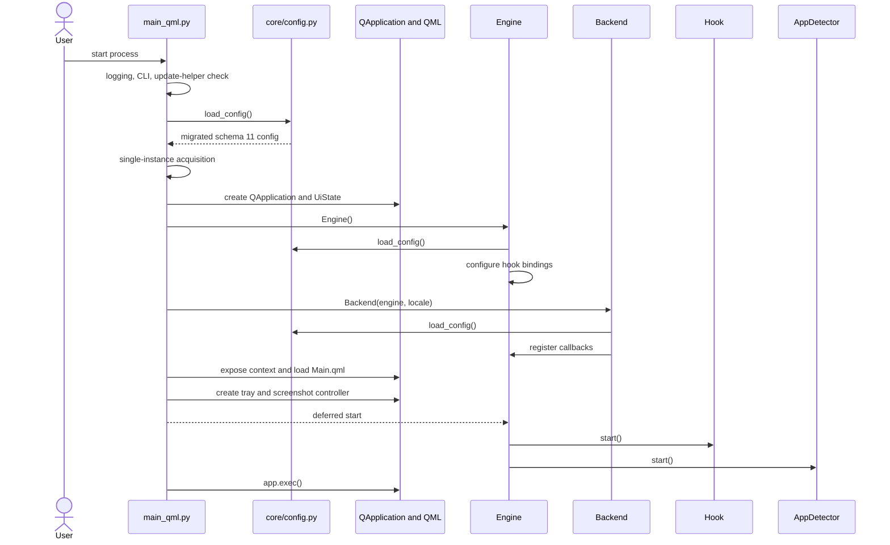
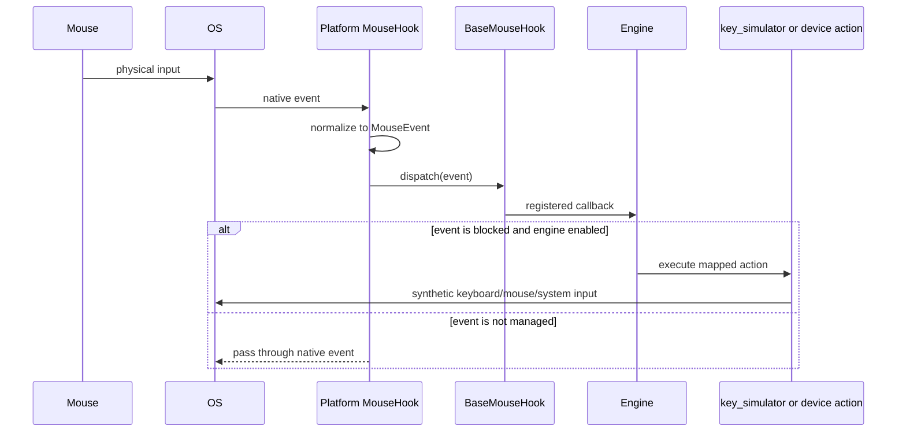
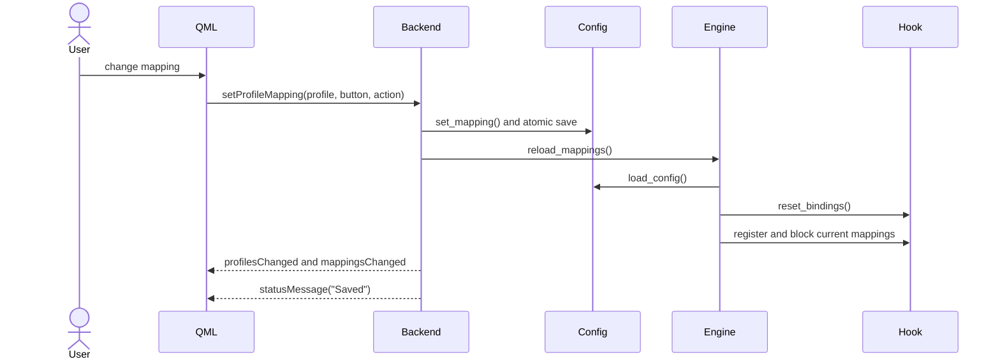
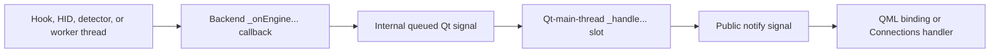
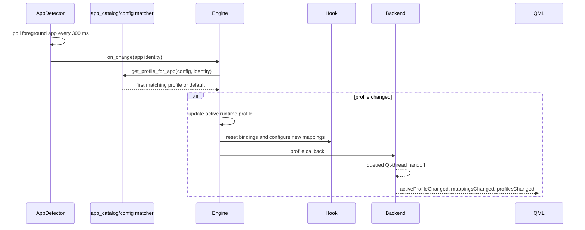
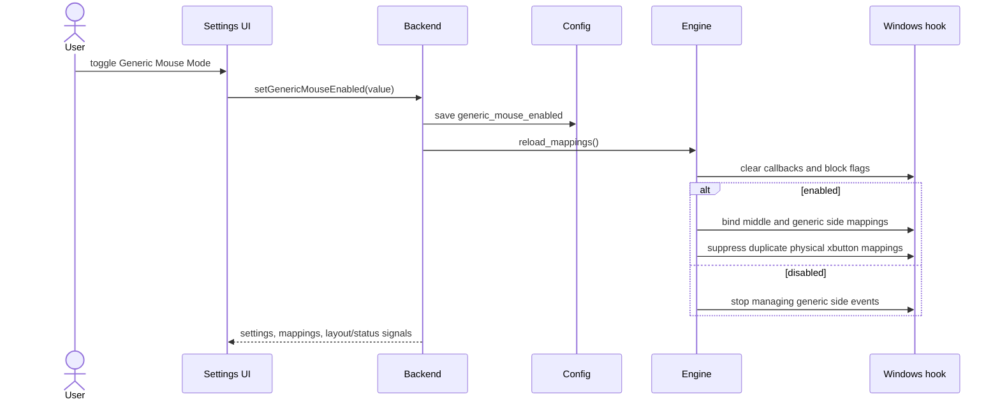
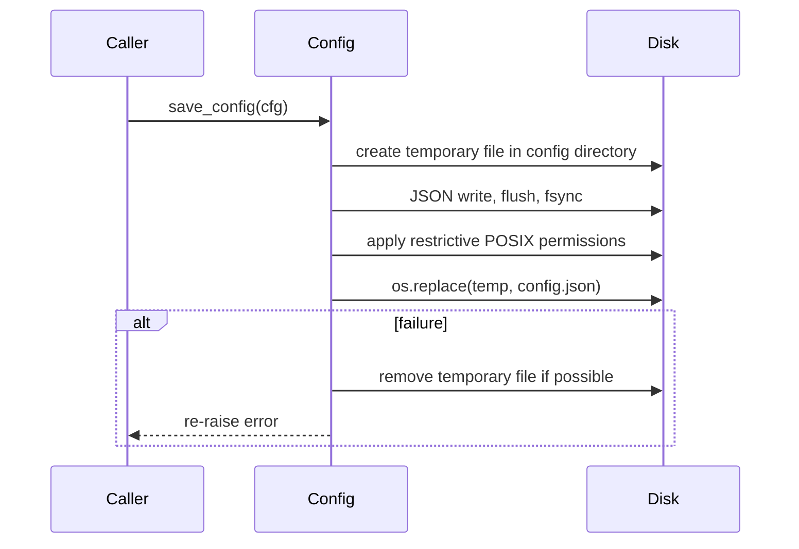
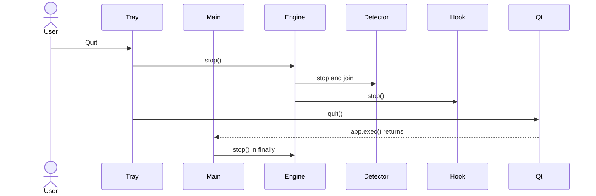

# PourInput Event Flow

This reference follows events through the current implementation. Component ownership is summarized in [ARCHITECTURE.md](ARCHITECTURE.md), while persistent and transient data are separated in [STATE_MANAGEMENT.md](STATE_MANAGEMENT.md).

## Contents

- [Application startup](#application-startup)
- [Mouse event flow](#mouse-event-flow)
- [UI event flow](#ui-event-flow)
- [Signal and callback relationships](#signal-and-callback-relationships)
- [Profile switching](#profile-switching)
- [Settings updates](#settings-updates)
- [Generic Mouse Mode](#generic-mouse-mode)
- [Save operations](#save-operations)
- [Shutdown](#shutdown)
- [Known constraints](#known-constraints)

## Application startup

If QML produces no root object, startup exits with failure. On macOS, the engine is not scheduled to start unless the Accessibility check succeeds. A second instance sends an activation message to the existing instance instead of creating another window.

## Mouse event flow

The engine wires callbacks and block flags together. A mapping of `none`, an unsupported device control, or a disabled Generic Mouse Mode normally leaves the native event unblocked. Synthetic input is marked or otherwise separated by platform code to avoid immediate recapture.

For paired mouse actions, down and up are injected separately. A 20-second safety timer releases an injected mouse button if the corresponding physical up event never arrives. For Multi-Action buttons, the down timestamp is recorded and the selected click or long-press action runs only on release.

## UI event flow

QML property bindings update in response to backend notify signals. Dialog visibility, selected editing profile, selected button, search text, and pending deletion are local QML state and do not travel through Python unless the user confirms an operation.

## Signal and callback relationships

The engine exposes ordinary Python callbacks for profile, connection, battery, DPI, SmartShift, debug, gesture, and status changes. The backend callback methods may run off the Qt thread, so they emit internal signals such as `_profileSwitchRequest` and `_connectionChangeRequest`. Those signals are connected with `Qt.QueuedConnection` to handlers that update backend fields and emit public QML notify signals.

SmartShift is a special case: the callback stages a value and queues `_handleSmartShiftRead` with `QMetaObject.invokeMethod` because the Windows low-level hook thread is not a reliable signal-emission context.

## Profile switching

Switching profiles does not restart the hook or HID listener. Selecting a profile row in `MousePage.qml` changes the editing target only; foreground-app detection remains the owner of the active runtime profile. See [PROFILE_SYSTEM.md](PROFILE_SYSTEM.md).

## Settings updates

Settings follow one of four paths:

1. **Persist and notify only:** start minimized, update checks, appearance, screenshot directory.
2. **Persist and rewire:** scroll inversion, trackpad filtering, gesture threshold, Generic Mouse Mode.
3. **Persist and write to a device:** DPI and SmartShift settings.
4. **External state then persist:** start at login; failure triggers rollback or an explicit inconsistency message.

Language differs: QML calls `LocaleManager.setLanguage()`, QML bindings and tray text react to `languageChanged`, and `main_qml.py` reloads and saves the language preference.

## Generic Mouse Mode

The mode is forced off by engine logic on non-Windows platforms. When enabled without a connected supported device, the UI exposes middle plus two generic side buttons. With a device connected, it removes Logitech `xbutton1`/`xbutton2` UI duplicates and uses `generic_xbutton1`/`generic_xbutton2` for the standard Windows side events. Disabled or unmapped standard events pass through natively.

## Save operations

All configuration saves use the same atomic sequence:

Profile and mapping helpers save internally. Most backend setting slots mutate their local configuration and call `save_config()` directly. Hardware reads may update backend display state without saving; for example, `_handleDpiRead` updates the UI copy, while a user DPI change is persisted.

## Shutdown

Closing the main window hides it rather than ending the process. Update installation is another controlled shutdown path: the backend stops the engine, launches the Windows helper, and asks `QCoreApplication` to quit. If helper launch fails, it attempts to restart the engine.

## Known constraints

- The callback bridge is explicit rather than generated; adding a new runtime state normally requires an engine callback, an internal backend signal/handler, and a public notify signal.
- Profile polling deliberately retains the last profile when the foreground application cannot be resolved because `AppDetector` does not call the change callback for falsey results.
- Settings saves are synchronous on the caller thread; update work and selected device operations use worker threads where implemented.
- Native event interception details differ by platform even though the normalized event path is shared.
