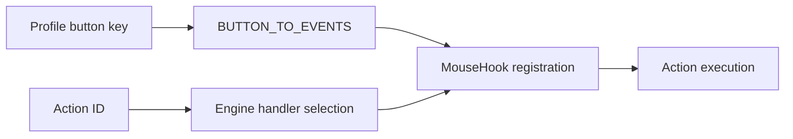
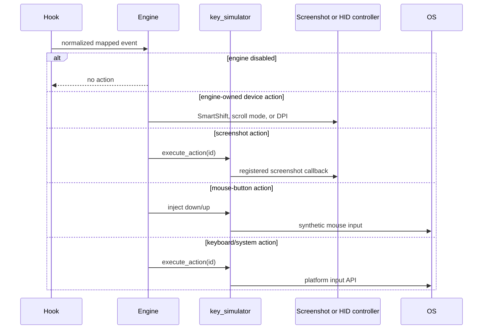

# PourInput Mouse Mapping System

This document describes the implemented button-to-action pipeline. Profile ownership is in [PROFILE_SYSTEM.md](PROFILE_SYSTEM.md), and end-to-end sequences are in [EVENT_FLOW.md](EVENT_FLOW.md).

## Contents

- [Mapping model](#mapping-model)
- [Supported button keys](#supported-button-keys)
- [Action model](#action-model)
- [Execution pipeline](#execution-pipeline)
- [Multi-Action behavior](#multi-action-behavior)
- [Generic Mouse Mode](#generic-mouse-mode)
- [Validation and conflict handling](#validation-and-conflict-handling)
- [Implemented extension seams](#implemented-extension-seams)
- [Current limitations](#current-limitations)

## Mapping model

A mapping is a profile-local dictionary entry from a stable button key to an action ID. `core/config.py` supplies button labels, event relationships, Multi-Action membership, default mappings, and the `_long` naming convention. Labels are translated only when projected to the UI.

## Supported button keys

The configuration understands these keys. Actual visibility and interception depend on platform and detected device capabilities.

| Key | Meaning | Normalized event(s) | Multi-Action |
|---|---|---|---|
| `middle` | Middle button | `middle_down`, `middle_up` | Yes |
| `xbutton1` | Logitech/physical back control | `xbutton1_down`, `xbutton1_up` | Yes |
| `xbutton2` | Logitech/physical forward control | `xbutton2_down`, `xbutton2_up` | Yes |
| `generic_xbutton1` | Windows standard side button 1 | `xbutton1_down`, `xbutton1_up` | Yes |
| `generic_xbutton2` | Windows standard side button 2 | `xbutton2_down`, `xbutton2_up` | Yes |
| `gesture` | Gesture-button tap | `gesture_click` | No |
| `gesture_left/right/up/down` | Gesture swipes | corresponding `gesture_swipe_*` | No |
| `hscroll_left/right` | Horizontal wheel direction | corresponding `hscroll_*` | No |
| `mode_shift` | Logitech mode-shift/SmartShift control | `mode_shift_down`, `mode_shift_up` | Yes |
| `dpi_switch` | Logitech DPI switch control | `dpi_switch_down`, `dpi_switch_up` | No |

For Multi-Action keys, the long-press slot is stored as `<key>_long`. The default schema also includes `mode_shift_long`, `middle_long`, physical and generic side-button long mappings.

## Action model

`core/key_simulator.py` defines a platform-specific `ACTIONS` catalog. Entries contain a stable ID, display label, category, and platform execution data. Supported action families include navigation, browser, editing, media, system/window operations, mouse clicks, scrolling, screenshots, and no action.

Custom shortcuts use IDs in the form `custom:<canonical shortcut>`. `core/key_registry.py` parses, canonicalizes, validates, and formats shortcut names. Screenshot action IDs are routed to the platform controller registered by `main_qml.py`. Three device actions are handled by the engine before the general simulator:

- `toggle_smart_shift`
- `switch_scroll_mode`
- `cycle_dpi`

Unknown action IDs and `none` do not execute an action.

## Execution pipeline

At every hook refresh, the engine clears prior callbacks and block flags, applies current scroll/gesture settings, evaluates device capabilities, and registers only the relevant events. A mapped event is blocked before its callback executes. A pass-through event is not added to the block set.

Horizontal-wheel actions use an accumulator and cooldown. Volume actions have a shorter cooldown than other actions. Gesture direction handling is enabled only when a direction is mapped and the connected device is known or conservatively allowed to support the gesture control.

## Multi-Action behavior

Multi-Action is enabled only when:

- the button is in `MULTI_ACTION_BUTTONS`;
- its long action is not `none`; and
- both down and up events exist.

On down, the engine records `time.monotonic()`. On up, it compares the duration with `multi_action_long_press_threshold_ms`; the default is 300 ms and the engine clamps invalid runtime values to the default. A duration at or above the threshold executes the long action, otherwise the click action. When no long action is configured, the ordinary single-action path is retained.

The action occurs on release in the Multi-Action path. This avoids firing the click action before the engine knows whether the press will become long.

## Generic Mouse Mode

Generic Mouse Mode is a Windows-only configuration switch. It reuses the same Windows low-level middle and XBUTTON events, engine action execution, and Multi-Action timing; it is not a separate hook implementation.

When enabled:

- `middle` is available for standard middle-button mapping;
- `generic_xbutton1` and `generic_xbutton2` map standard side-button events;
- detected Logitech identity and catalog button defaults do not authorize physical XBUTTON mappings;
- exactly one generic mapping source is registered for each XBUTTON event;
- only configured events are blocked.

When disabled, generic side-button mappings are not registered and standard side events remain native. Middle-button mapping without Generic Mouse Mode requires a detected device reporting `middle` support.

The Windows low-level mouse hook reports `XBUTTON1` and `XBUTTON2` but no physical device handle. Raw Input device handles are logged in Debug Mode when available, but those asynchronous messages are not treated as correlated with a low-level event. Generic Mouse Mode is deliberately device-agnostic and cannot distinguish which of several connected mice produced a standard XBUTTON event.

## Validation and conflict handling

| Concern | Implemented handling |
|---|---|
| Unsupported control | Device capability/layout filtering hides it; engine skips wiring where support is explicitly absent |
| Unknown capability | Engine preserves conservative fallback behavior rather than assuming explicit non-support |
| Generic/physical side duplication | Windows wires only the explicit Generic Mouse Mode source for standard XBUTTON events |
| No action | Event is normally left unblocked and no callback is registered |
| Custom shortcut syntax | Backend uses `key_registry` to canonicalize, report parse errors, and flag reserved risky shortcuts |
| Missing up event | Mouse-action injection has a 20-second safety release where paired handling exists |
| Reconfiguration | `reset_bindings()` removes callbacks and block flags before the active mapping set is rebuilt |
| Rapid horizontal scroll | Accumulator and action-specific cooldown reduce repeated execution |

Configuration persistence does not validate that a stored action ID exists in the current platform catalog. UI choices provide valid IDs, but hand-edited or legacy unknown IDs become no-ops. The system has no general cross-button conflict detector because assigning the same action to several buttons is valid.

## Implemented extension seams

These are existing code seams, not promises of future behavior:

- Add a normalized event to `MouseEvent`, platform hooks, and `BUTTON_TO_EVENTS`.
- Add a stable button key and default mapping in `core/config.py`.
- Expose capability and layout metadata through `logi_devices.py`, `device_layouts.py`, and backend projection.
- Add an action consistently to each platform `ACTIONS` catalog and execution path.
- Extend `key_registry.py` when a new canonical shortcut key is supported.
- Use the registered screenshot-handler pattern for an action that must leave the hook thread.

Each extension requires focused config, engine, backend, platform, and UI tests; the shared dictionaries do not make the change automatic.

## Current limitations

- Double-click, macros, sequential actions, and action layers are not implemented.
- Long-press timeout is persisted in the schema but is fixed at 300 ms by the current UI.
- Generic Mouse Mode supports only middle and two standard side buttons and cannot separate physical source devices.
- Left/right button remapping, vertical wheel direction mappings, arbitrary extra buttons, and vendor events outside the normalized catalog are not part of Generic Mouse Mode.
- Capability availability and native interception vary by device firmware and platform.
