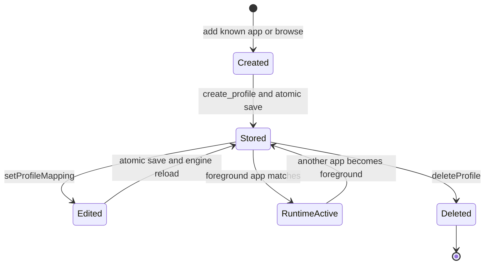
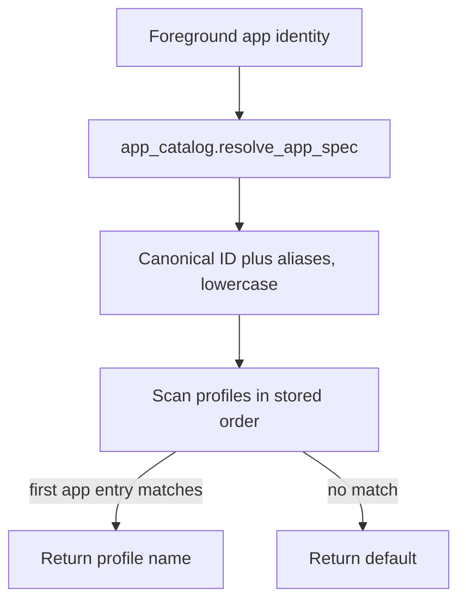

# PourInput Profile System

Profiles provide per-application mouse mappings. This document describes the implemented model and its limits. Mapping execution is covered by [MOUSE_MAPPING_SYSTEM.md](MOUSE_MAPPING_SYSTEM.md).

## Contents

- [Data model](#data-model)
- [Default profile](#default-profile)
- [Lifecycle](#lifecycle)
- [Selection and activation](#selection-and-activation)
- [Application matching](#application-matching)
- [Persistence](#persistence)
- [Validation and edge cases](#validation-and-edge-cases)
- [Implementation limitations](#implementation-limitations)

## Data model

Profiles live under the top-level `profiles` object in `config.json`. Each profile is keyed by an internal name and contains:

```json
{
  "label": "Google Chrome",
  "apps": ["chrome.exe"],
  "mappings": {
    "middle": "copy",
    "middle_long": "paste"
  }
}
```

The internal name is generated by the backend from a lowercased, underscore-normalized label, trimmed to 32 characters. The label is presentation text. `apps` contains platform app identities, aliases, or paths. `mappings` uses stable button keys and action IDs; localization never rewrites them.

## Default profile

The schema always supplies a `default` profile whose empty `apps` list represents the fallback for every unmatched application. `get_profile_for_app()` explicitly returns `default` when the app is empty or no profile matches. The UI prevents deletion of `default`, and the configuration helper also ignores such a request.

If `active_profile` names a missing profile, `get_active_mappings()` falls back to the default profile. If even that structure is missing, it falls back to the default mapping template.

## Lifecycle



Creation copies the mapping dictionary from the default profile. The backend rejects an unknown catalog ID and rejects an app already assigned to another profile. Browsed applications are normalized by platform, resolved through the app catalog where possible, and stored as a stable identity when one is known.

Deleting a non-default profile removes it, resets `active_profile` to `default` if necessary, saves, and reloads engine mappings.

## Selection and activation

There are two distinct concepts:

- **Editing selection:** `MousePage.qml.selectedProfile` determines which profile the UI displays and edits. Clicking a profile row changes only this QML-local value.
- **Runtime active profile:** `Engine._current_profile` and the configuration field `active_profile` determine which mappings are wired to the hook. `AppDetector` owns automatic changes.

When the engine activates a different profile, it updates its configuration copy, rewires the hook, and notifies the backend. The backend updates its own `active_profile` field and emits signals, causing the QML editing selection to follow the runtime profile.

The runtime switch itself does not call `save_config()`. A later backend save may persist the backend's current `active_profile`, but persistence of the last foreground-driven switch is not guaranteed on shutdown.

## Application matching



`AppDetector` produces platform-specific identities:

- Windows: normally the full executable path, with UWP child-process resolution.
- macOS: bundle identifier when available, then executable name or localized name.
- Linux: executable path from X11 `xdotool` or KDE Wayland `kdotool`.

The app catalog translates known IDs, paths, desktop IDs, bundle IDs, and aliases into a canonical entry. Matching is case-insensitive. If catalog resolution fails, the raw runtime identity is compared case-insensitively. The first matching profile wins; there is no priority field or multi-profile merge.

## Persistence

Creation, deletion, and mapping edits save immediately through `core/config.py`. Saves replace the entire JSON document atomically. Profiles do not have separate files, revision histories, or transactions independent of the global config.

Schema migration adds missing profile fields and mapping keys. The current schema is version 11. Migration also replaces legacy `wmplayer.exe` associations with `Microsoft.Media.Player.exe`.

## Validation and edge cases

| Case | Implemented behavior |
|---|---|
| Duplicate application | Backend refuses creation and shows a profile-exists status |
| Unknown catalog ID | `addProfile` returns without creating a profile |
| User cancels file picker | No change |
| Delete default | Ignored in backend and config helper |
| Delete active profile | Active field is reset to `default`; engine reloads |
| Missing app identity | Default profile is used; last detected app is retained by the detector until a new valid identity appears |
| Multiple profiles match | First profile in dictionary iteration order wins |
| Missing profile mapping key | Migration/default merging supplies known defaults on load |
| Unsupported button on current device | Mapping remains stored but backend filters it from the visible button list and engine capability checks may skip wiring it |
| Invalid config JSON | Load logs an error and returns defaults; the invalid file is not automatically renamed or repaired on disk |

Type repair is based on `DEFAULT_CONFIG`. It validates the default-shaped top-level data but is not a full schema for arbitrary extra profiles. Action IDs stored in mappings are not validated by `core/config.py`; an unknown action reaches the execution pipeline and becomes a no-op unless another handler recognizes it.

## Implementation limitations

- Profile names have no dedicated collision-resolution algorithm. Two different labels that normalize to the same 32-character key can overwrite the same dictionary entry through `create_profile()`.
- A profile supports an `apps` list, but the current creation UI creates one application association at a time and exposes no general association editor.
- Profile activation is polling-based at 300 ms and depends on platform foreground-app discovery.
- Non-KDE Wayland cannot currently resolve the foreground application through this implementation.
- Profiles are flat; inheritance, stacking, priorities, and action layers are not implemented.
