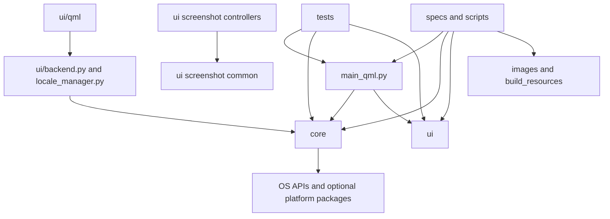

# PourInput Project Structure

This document maps the tracked repository structure. Generated local folders such as `.venv`, `build`, `dist`, `release`, caches, and ad hoc packaged archives are intentionally excluded.

## Contents

- [Directory tree](#directory-tree)
- [Top-level entry points](#top-level-entry-points)
- [Major folders](#major-folders)
- [Core package](#core-package)
- [UI package](#ui-package)
- [Dependency direction](#dependency-direction)
- [Public-interface notes](#public-interface-notes)

## Directory tree

```text
PourInput/
├── .github/
│   ├── ISSUE_TEMPLATE/
│   └── workflows/
├── build_resources/
├── core/
├── docs/
├── images/
├── packaging/
│   └── linux/
├── scripts/
├── tests/
├── tools/
├── ui/
│   └── qml/
├── main_qml.py
├── build_support.py
├── PourInput.spec
├── PourInput-mac.spec
├── PourInput-linux.spec
├── build.bat
├── build_macos_app.sh
├── requirements.txt
└── project and community Markdown files
```

## Top-level entry points

| Path | Purpose | Depends on | Public interface |
|---|---|---|---|
| `main_qml.py` | Runtime composition root and desktop lifecycle | `core`, `ui`, PySide6 | `main()` and documented CLI flags |
| `build_support.py` | Build-time metadata/resource helpers | Python stdlib and repository assets | Functions consumed by specs/tests |
| `PourInput*.spec` | PyInstaller definitions per platform | Source packages, images, QML, build resources | PyInstaller build inputs |
| `build.bat`, `build_macos_app.sh` | Local platform build workflows | Python/PyInstaller/toolchain | Developer command surface |
| `requirements.txt` | Runtime/development Python dependencies | Package indexes | Installation input |

## Major folders

| Folder | Purpose | Logical owner | Main dependencies | Public interfaces |
|---|---|---|---|---|
| `.github/` | CI, release automation, issue/PR templates | Maintainers | GitHub Actions | Workflow triggers and templates |
| `build_resources/` | Packaging metadata and platform build resources | Release engineering | PyInstaller/platform tools | Files referenced by build specs/scripts |
| `core/` | Platform-neutral orchestration plus platform service implementations | Runtime maintainers | stdlib, OS APIs, HID/evdev dependencies | Python modules/classes/functions |
| `docs/` | Design, architecture, brand, screenshot, and release-visual references | Product/engineering | Repository source of truth | Relative-linked Markdown documents |
| `images/` | Runtime logos, icons, app/device art, and screenshots used by UI/docs | UI/brand maintainers | QML, entry point, docs, packaging | Stable asset paths |
| `packaging/` | Non-PyInstaller platform installation resources | Release engineering | Linux desktop/udev conventions | Install scripts, desktop file, icon ladder |
| `scripts/` | Focused build/release asset automation | Release engineering | PowerShell/Python | Script command-line interfaces |
| `tests/` | `unittest` coverage for runtime, UI bridge, platform policy, build, and updates | Module owners | Application modules, mocks | Test discovery via `python -m unittest` |
| `tools/` | Developer utilities and maintenance helpers | Maintainers | Repository/runtime modules as needed | Script entry points, not app runtime APIs |
| `ui/` | QML bridge, localization, screenshots, and QML presentation | UI maintainers | PySide6 and selected `core` services | `Backend`, `LocaleManager`, controllers, QML files |

## Core package

| Area | Files | Responsibility and interface |
|---|---|---|
| Configuration/profiles | `config.py`, `app_catalog.py` | `load_config`, `save_config`, mapping/profile helpers, catalog resolution |
| Runtime orchestration | `engine.py` | `Engine` lifecycle, callbacks, remapping/device APIs |
| Hook abstraction | `mouse_hook.py`, `mouse_hook_base.py`, `mouse_hook_contract.py`, `mouse_hook_types.py` | Selected `MouseHook`, normalized `MouseEvent`, shared behavior and protocol |
| Platform hooks | `mouse_hook_windows.py`, `mouse_hook_macos.py`, `mouse_hook_linux.py`, `mouse_hook_stub.py` | Native capture, pass/block behavior, platform resources |
| HID/device model | `hid_gesture.py`, `logi_devices.py`, `logi_device_catalog.py`, `device_layouts.py` | HID listener, device/capability records, catalogs, UI layouts |
| Action execution | `key_simulator.py`, `key_registry.py` | Platform `ACTIONS`, injection functions, shortcut parsing |
| Desktop services | `app_detector.py`, `startup.py`, `accessibility.py`, `linux_permissions.py` | Foreground identity, login startup, trust/permission status |
| Updates | `updater.py`, `update_installer.py` | Release-state models, checks, manifest/archive validation, install planning |
| Operations | `log_setup.py`, `version.py` | Logging and application/build metadata |

The package's practical interfaces are imported functions and classes rather than a formally versioned Python API. `core/__init__.py` does not provide an aggregate facade.

## UI package

| Area | Files | Responsibility and interface |
|---|---|---|
| QML bridge | `backend.py` | `Backend` QObject properties, signals, and slots |
| Localization | `locale_manager.py` | `LocaleManager`, available language metadata, translation helpers |
| Screenshot common | `screenshot_common.py`, `screenshot_overlay.py` | Output paths, shared geometry/overlay behavior |
| Screenshot platforms | `windows_screenshot.py`, `macos_screenshot.py`, `linux_screenshot.py` | Controller classes registered by `main_qml.py` |
| Presentation | `qml/*.qml`, `qml/Theme.js` | Application shell, pages, reusable controls, design tokens |

See [QML_STRUCTURE.md](QML_STRUCTURE.md) for the component hierarchy.

## Dependency direction



Core modules do not import the QML bridge. `main_qml.py` is allowed to know both layers. `ui/backend.py` depends on multiple core services because it is the desktop application adapter. Screenshot controllers live under `ui` because they use Qt UI/overlay facilities, and the entry point registers them with the core action simulator through a callback.

## Public-interface notes

- QML-facing compatibility is defined by backend property, signal, and slot names plus context-property names in `main_qml.py`.
- Hook compatibility is described by `MouseHookLike`, `BaseMouseHook`, and the normalized `MouseEvent` strings.
- Persisted compatibility is defined by schema 11 keys, migrations, stable button keys, and action IDs.
- Build compatibility is defined by the spec files, asset paths, platform scripts, and CI workflows.
- Device-layout and catalog records are internal Python data contracts but are consumed across hook, engine, backend, and QML projections.
- No folder has a machine-readable ownership file; the owners above are responsibility labels inferred from implementation boundaries, not named people or teams.

Related references: [ARCHITECTURE.md](ARCHITECTURE.md), [EVENT_FLOW.md](EVENT_FLOW.md), [SETTINGS_ARCHITECTURE.md](SETTINGS_ARCHITECTURE.md), and [DEVELOPMENT.md](../DEVELOPMENT.md).
