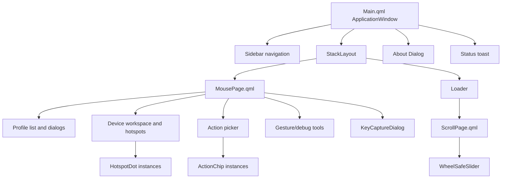

# PourInput QML Structure

This document describes the current `ui/qml` implementation and ownership boundaries. Visual rules are defined in [POUR_DESIGN_SYSTEM.md](POUR_DESIGN_SYSTEM.md) and reusable-component guidance in [POUR_COMPONENTS.md](POUR_COMPONENTS.md).

## Contents

- [Directory layout](#directory-layout)
- [Composition hierarchy](#composition-hierarchy)
- [Main.qml](#mainqml)
- [Page ownership](#page-ownership)
- [Reusable components](#reusable-components)
- [Theme.js](#themejs)
- [Python dependencies](#python-dependencies)
- [State ownership](#state-ownership)
- [Implementation limitations](#implementation-limitations)

## Directory layout

```text
ui/qml/
├── Main.qml
├── MousePage.qml
├── ScrollPage.qml
├── ActionChip.qml
├── AppIcon.qml
├── HotspotDot.qml
├── KeyCaptureDialog.qml
├── WheelSafeSlider.qml
└── Theme.js
```

There is no QML module manifest or generated type registration. Files use relative imports, and `main_qml.py` loads `Main.qml` from disk or the PyInstaller resource root.

## Composition hierarchy



`MousePage` is instantiated eagerly because it is the default page. `ScrollPage` is loaded on first navigation through a `Loader` and retained once created. About is a modal `Dialog` inside `Main.qml`; add-profile, delete-profile, and shortcut capture overlays belong to `MousePage.qml`.

## Main.qml

`Main.qml` owns the application shell:

- window dimensions, title, close-to-tray behavior, and Material theme;
- appearance derivation from `uiState`;
- 76-pixel sidebar, page navigation, tooltips, and About entry;
- `StackLayout` page selection;
- About dialog and application/build metadata;
- global status toast connected to `backend.statusMessage`;
- top-level keyboard shortcut blocking when modal content is visible.

The shell has two navigation destinations: Mouse & Profiles (`MousePage`) and Point & Scroll/Settings (`ScrollPage`). About is a dialog, not a third stack page.

## Page ownership

### MousePage.qml

`MousePage.qml` owns the primary mapping workspace and most domain-specific UI state. It contains:

- profile browsing, editing selection, add-app search, browse-for-app, and delete confirmation;
- device status, battery, manual layout override, and connected-device metadata;
- mouse image and interactive hotspot projection;
- Generic Mouse Mode presentation and mapping visibility;
- click and long-press action selection;
- custom shortcut capture;
- gesture thresholds, device DPI preset slots, diagnostics, and device-info export.

The page refreshes its local mapping projection through backend getters after `profilesChanged`, `activeProfileChanged`, `mappingsChanged`, and `deviceLayoutChanged`.

### ScrollPage.qml

`ScrollPage.qml` owns the scrollable settings surface:

- DPI value and quick presets;
- SmartShift mode, enablement, and threshold;
- appearance and language;
- start-at-login, start-minimized, and update checks;
- screenshot directory;
- vertical/horizontal inversion and macOS trackpad filtering.

It listens for `dpiFromDevice` and `settingsChanged`. Debounce timers prevent continuous slider motion from producing an immediate backend call for every intermediate value.

## Reusable components

| Component | Public contract | Current use |
|---|---|---|
| `ActionChip.qml` | Action ID/label/current state and `picked` signal | Action choices in the mapping workspace |
| `AppIcon.qml` | Icon name, color, and source resolution | Sidebar and other symbolic icons |
| `HotspotDot.qml` | Image reference, normalized coordinates, button metadata, selection behavior | Device-map control overlays |
| `KeyCaptureDialog.qml` | `open`, `close`, captured/cancelled signals, shortcut validation | Custom shortcut input |
| `WheelSafeSlider.qml` | Range/value/colors and `moved` signal | Pointer/device sliders where wheel-safe behavior is needed |

`HotspotDot` expects its hosting `MousePage` context for selection callbacks, so it is reusable within the current page architecture but is not fully standalone. `KeyCaptureDialog` calls backend shortcut helpers directly.

## Theme.js

`Theme.js` is a `.pragma library` containing shared radii, a 4–32 pixel spacing scale, and `palette(isDark)`. Each palette provides surface, accent, text, border, semantic, and tooltip colors.

It does not own typography sizes, component heights, animation durations, shadows, or every layout measurement. Those remain local to QML files. As a result, it is the color/spacing foundation rather than a complete declarative theme object.

## Python dependencies

QML relies on context objects registered by `main_qml.py`:

| Context object | QML role |
|---|---|
| `backend` | Domain properties, commands, and change signals |
| `uiState` | Appearance, system dark mode, font family |
| `lm` | Reactive strings and translation helpers |
| `launchHidden` | Initial window visibility |
| Application metadata | Title and About content |

`AppIconProvider` and `SystemIconProvider` serve `image://appicons/` and `image://systemicons/`. Static product/device images use relative resource paths and preserve aspect ratio where configured.

## State ownership

QML owns short-lived presentation state: current page, hovered navigation item, open dialogs, search query, selected editing profile/button/action, local slider interaction, and toast visibility. Python owns persisted settings, runtime input state, device connection/capability state, and asynchronous service progress.

QML should not treat a local selection as persisted until a backend slot succeeds. Conversely, backend notify signals are the invalidation mechanism; QML pages explicitly refresh list-shaped projections because nested JavaScript objects do not become observable Python models automatically.

See [STATE_MANAGEMENT.md](STATE_MANAGEMENT.md).

## Implementation limitations

- `MousePage.qml` is a large multi-responsibility file rather than a hierarchy of page sections.
- Several reusable-looking elements remain inline in `Main.qml`, `MousePage.qml`, and `ScrollPage.qml`.
- List data is exposed as `QVariantList`/JavaScript objects rather than dedicated Qt item models.
- Component access sometimes depends on context properties and ancestor IDs, reducing isolation.
- Theme tokens do not cover all proportions and typography, so local constants can drift.
- Only `ScrollPage` is lazy-loaded; the large mapping page and dialogs are parsed at startup.
