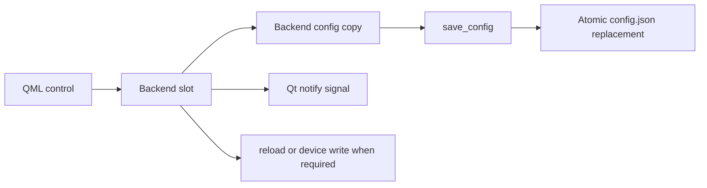

# PourInput Settings Architecture

Settings are stored with profiles in one versioned JSON document. This document covers settings ownership and persistence; runtime synchronization details are in [STATE_MANAGEMENT.md](STATE_MANAGEMENT.md).

## Contents

- [Settings groups](#settings-groups)
- [Defaults and schema](#defaults-and-schema)
- [Persistence](#persistence)
- [Migration](#migration)
- [Localization](#localization)
- [Theme management](#theme-management)
- [DPI and device settings](#dpi-and-device-settings)
- [Platform integration](#platform-integration)
- [Limitations](#limitations)

## Settings groups

The schema and current UI expose or consume these groups:

| Group | Keys | Owner and effect |
|---|---|---|
| Startup | `start_minimized`, `start_at_login` | Entry-point launch visibility; backend plus `core/startup.py` |
| Input routing | `generic_mouse_enabled`, `invert_vscroll`, `invert_hscroll`, `ignore_trackpad` | Engine hook wiring and platform hook behavior |
| Pointer/device | `dpi`, optional `dpi_presets`, `smart_shift_mode`, `smart_shift_enabled`, `smart_shift_threshold` | Backend, engine, HID++ device |
| Gestures | `gesture_threshold`, `gesture_deadzone`, `gesture_timeout_ms`, `gesture_cooldown_ms` | Engine and hook gesture tracker |
| Multi-Action | `multi_action_long_press_threshold_ms` | Engine click/long-press decision |
| Appearance | `appearance_mode` | Backend and `UiState`; QML palette selection |
| Language | `language` | `LocaleManager` and entry-point persistence callback |
| Screenshots | `screenshot_directory` | Backend path factory and screenshot controllers |
| Updates | `check_for_updates`, `update_check_state` | Backend timer, updater, and persistence |
| Device UI | `device_layout_overrides` | Backend device layout projection |
| Diagnostics | `debug_mode` | Backend, engine, hook debug capture |
| Internal tuning | `hscroll_threshold` | Engine horizontal-scroll accumulation |

Not every persisted key has a visible control. Gesture deadzone, timeout, cooldown, horizontal-scroll threshold, Multi-Action threshold, and some DPI preset behavior are currently code/config concerns rather than general Settings-page controls.

## Defaults and schema

`core/config.py.DEFAULT_CONFIG` is the executable default source. The current schema version is 11. Defaults are deep-copied when no usable file exists. Loading merges newly introduced default keys without deleting unknown keys, then repairs types by comparing known fields with the default template.

The Settings page reads backend properties, not the JSON file. Current `ScrollPage.qml` sections cover DPI/SmartShift, appearance, language, startup/update checks, screenshot destination, scroll inversion, and macOS trackpad filtering. Generic Mouse Mode is presented in the mouse workspace rather than being a separate architecture.

## Persistence

Most changes save immediately. There is no Apply button, batch settings transaction, or separate settings database. `save_config()` writes the full document through a temporary file and atomic replacement.

The engine has a separate configuration copy. Settings that affect hook wiring call `engine.reload_mappings()`, which reloads from disk. DPI and SmartShift setters also persist inside the engine, resulting in a second safe save of the same logical values after the backend save.

## Migration

`_migrate()` applies ordered, in-place upgrades from the stored version:

| Target version | Added or changed |
|---|---|
| 2 | Profile app lists, scroll inversion, DPI |
| 3 | Gesture settings and gesture mapping keys |
| 4 | Device layout overrides |
| 5 | `start_with_windows` renamed to `start_at_login` |
| 6–8 | Mode-shift mapping introduced and default evolved to `switch_scroll_mode` |
| 9 | Trackpad filtering |
| 10 | Multi-Action threshold and long mappings |
| 11 | Generic Mouse Mode and generic side-button mappings |

After versioned steps, current unversioned defaults such as appearance, language, screenshots, updates, and diagnostics are ensured. Known Multi-Action keys are also completed for every profile. Migration is forward-only; there is no downgrade path or backup copy created before migration.

## Localization

`LocaleManager` supports `en` and `zh_CN`. It exposes `language`, a reactive `strings` map, language choices, and helpers for button, action, and category labels. Unsupported codes normalize to English at construction or are ignored by `setLanguage()`.

QML calls `lm.setLanguage(code)`. `languageChanged` refreshes QML bindings and tray labels. `main_qml.py` responds by reloading the latest config, changing only `settings.language`, and saving it. This separate persistence path avoids making the locale manager depend on configuration code.

Stable action IDs, button keys, application identities, and profile mapping data are not localized.

## Theme management

`appearance_mode` accepts `system`, `light`, or `dark`; the backend normalizes any other UI-provided value to `system`. At startup, `main_qml.py` assigns the backend value to `UiState.appearanceMode`. Later `settingsChanged` signals resynchronize it.

`UiState` combines the selected mode with the system color scheme. `Main.qml` derives `darkMode`, selects the Qt Material theme, and calls `Theme.palette(darkMode)`. Child components either use `root.theme` or call the same palette function with `uiState.darkMode`. `Theme.js` owns shared colors, radii, and spacing tokens; component-specific sizes remain in QML.

See [QML_STRUCTURE.md](QML_STRUCTURE.md) and [POUR_DESIGN_SYSTEM.md](POUR_DESIGN_SYSTEM.md).

## DPI and device settings

DPI is clamped through `core/logi_devices.py` against the connected device range, with global fallback bounds when device data is unavailable. The backend saves the clamped value and asks the engine to apply it. The engine saves its copy and writes through the HID gesture listener only when capability information does not explicitly rule out adjustable DPI.

SmartShift settings are persisted as mode, enabled state, and threshold. The engine writes them through HID++ and replays saved DPI/SmartShift settings after HID readiness or reconnection. Replay runs on a worker thread, includes delayed settling and one retry path, and reports failure without discarding saved preferences. Periodic hardware reads update backend/UI state; those reads do not always persist a new preference.

DPI presets shown in `ScrollPage.qml` are filtered against the current device maximum. Four optional preset slots are also handled in the mouse workspace and may introduce `dpi_presets` even though that key is not in the base default template.

## Platform integration

`start_at_login` is applied to operating-system state before configuration is committed. Supported implementations are Windows per-user registry startup, macOS LaunchAgent, and Linux autostart desktop entry. The backend rolls OS state back if saving fails; if rollback also fails, it reports an inconsistent state.

`start_minimized` affects launch visibility together with `--start-hidden`; `--show-window` overrides both. Login-startup support is detected at runtime, and an unavailable integration clears the effective backend value.

Screenshot directory selection validates an existing directory. An empty value means the platform default screenshots directory. Update-check state is machine-local operational metadata stored alongside user preferences.

## Limitations

- There is no formal JSON Schema, settings registry, or per-key metadata declaration.
- Type validation covers keys represented in defaults; optional keys such as `dpi_presets` do not receive the same default-template validation.
- Numeric ranges are enforced by individual consumers, not centrally.
- Backend and engine can save the same device setting in sequence because they own separate config copies.
- Appearance tokens are centralized, but not every QML measurement is a token.
- Migration errors fall into the general load failure path and return defaults; the invalid file is not automatically backed up.
