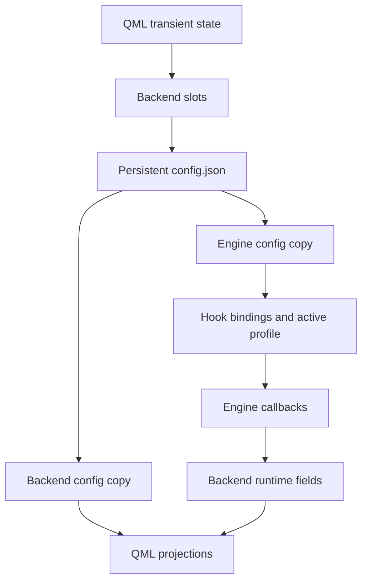
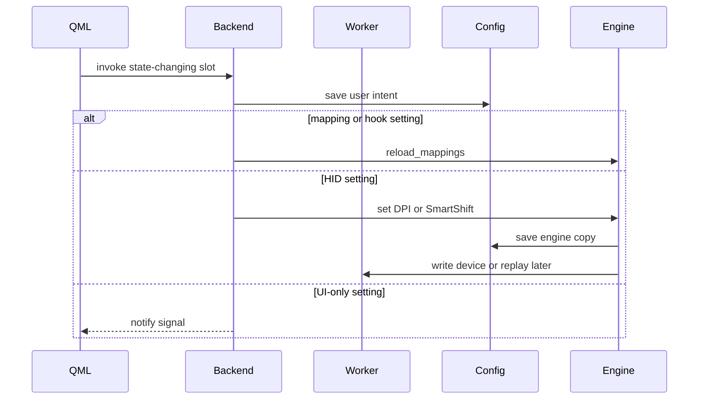

# PourInput State Management

PourInput uses explicit Python objects, JSON persistence, Qt signals, and QML properties rather than a single centralized state store. This document identifies each state class and its owner.

## Contents

- [State domains](#state-domains)
- [Ownership map](#ownership-map)
- [Persistent state](#persistent-state)
- [Runtime application state](#runtime-application-state)
- [UI state](#ui-state)
- [Synchronization paths](#synchronization-paths)
- [Update flow](#update-flow)
- [Consistency boundaries](#consistency-boundaries)

## State domains

## Ownership map

| State | Authoritative owner | Persistence | Notification |
|---|---|---|---|
| Profiles and mappings | `config.json`; backend for edits, engine for execution | Atomic JSON save | Backend mapping/profile signals |
| Global settings | `config.json`; backend setters | Atomic JSON save | `settingsChanged` and specific signals |
| Runtime active profile | Engine | Not saved on each auto-switch | Engine callback to backend |
| Hook bindings/block flags | Engine plus MouseHook | Rebuilt from config | Debug/status callbacks only |
| Device/HID readiness | MouseHook/HID listener | No | Engine callback to queued backend handler |
| Battery/current hardware state | HID listener and engine polling | Generally no | Backend device signals |
| Update check/install progress | Backend workers | Check metadata only | `updateInstallChanged`, `updateAvailable` |
| Appearance selection | Config/backend; `UiState` projection | Yes | Backend to UiState to QML |
| System appearance | `UiState` | No | Qt color-scheme signals |
| Language | `LocaleManager`; config preference | Yes | `languageChanged` |
| Page/dialog/search/selection | QML component | No | QML bindings and handlers |

## Persistent state

`config.json` contains schema version, `active_profile`, profiles, mappings, and settings. It is the only primary user-state file. Update staging files and logs are operational artifacts, not part of the user configuration model.

`core/config.py` owns defaults, migration, partial type repair, and atomic whole-document saves. Backend operations generally update and persist immediately. Profile helpers also save internally. There is no undo history, database, or multi-process merge strategy; single-instance enforcement reduces concurrent writer risk.

## Runtime application state

`Engine` owns:

- enable/disable state controlled by the tray;
- active runtime profile and mapping callbacks;
- input-down timestamps and mouse safety-release timers;
- horizontal-scroll accumulators/cooldowns;
- background battery polling and saved-setting replay;
- callback registrations to the backend.

`MouseHook` owns captured-event callbacks, the blocked-event set, gesture tracking, connection state, and platform-specific threads/resources. `HidGestureListener` owns HID transport/device state. `AppDetector` owns its last valid foreground identity and polling thread.

Backend owns UI-facing runtime projections, including device identity/layout, battery, diagnostic buffers, gesture recording, update status, and timer state. Its diagnostic buffers are bounded in memory and are not configuration.

## UI state

`Main.qml` owns current navigation and overlay/toast state. `MousePage.qml` owns editing selection, selected button/actions, app search/results, and dialog state. `ScrollPage.qml` owns control interaction and debounce timers. `KeyCaptureDialog.qml` owns the in-progress shortcut text and validation presentation.

The QML editing profile is not the runtime active profile. It starts from and follows `backend.activeProfile`, but a manual profile-row click only changes the page-local editing target.

## Synchronization paths

### Backend edit to engine

1. QML calls a backend slot.
2. Backend mutates its config copy and saves.
3. For mapping/hook settings, backend calls `engine.reload_mappings()`.
4. Engine reloads the file, resets hook bindings, and reconstructs callbacks.
5. Backend emits Qt signals so QML refreshes.

### Engine worker to QML

1. Hook, detector, HID, or worker invokes an engine callback.
2. Backend callback emits an internal queued signal or queued method invocation.
3. Qt-main-thread handler updates backend runtime fields.
4. Public notify signals invalidate QML bindings.

### Appearance

1. Config initializes backend appearance.
2. `main_qml.py` assigns it to `UiState`.
3. `settingsChanged` keeps `UiState` synchronized.
4. `UiState.darkMode` combines user choice and system scheme.
5. QML selects Material and `Theme.js` palettes.

## Update flow

Device connection changes may cause the engine to rebuild bindings because the effective capability set changes. They also start/stop battery polling and trigger saved DPI/SmartShift replay when HID features become ready.

## Consistency boundaries

- Backend and engine do not share one configuration object. Direct assignment is used in a few profile/Generic Mouse Mode paths, but disk reload is the normal mapping synchronization boundary.
- Save failures are generally allowed to propagate from configuration helpers; start-at-login has explicit OS rollback because it spans two state systems.
- Hardware writes can fail after preferences are saved. The saved preference remains and reconnection replay attempts convergence later.
- Hardware reads update live UI state without necessarily overwriting saved user intent.
- Backend list properties return snapshots. QML must refresh after the corresponding signal rather than mutate them as authoritative data.
- Foreground profile activation is runtime state first; it is not guaranteed to be persisted solely because a switch occurred.
